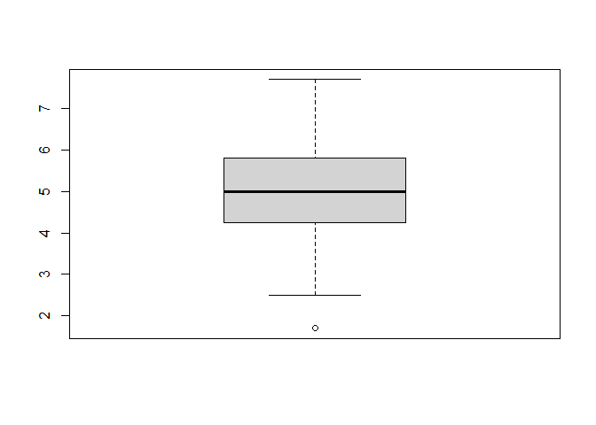
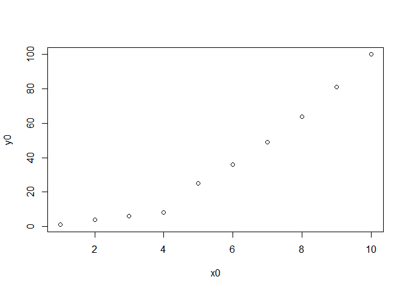

Ejercicios
================
Abby Celis
18/11/2021

# EJERCICIOS EN MARKDOWN

## PARTE 1

### 1. Calcula los valores numéricos aproximados de

#### a)

``` r
(0.3*0.15)/(0.3*0.15+0.2*0.8+0.5*0.12) 
```

    ## [1] 0.1698113

#### b)

``` r
(5^6)*exp(-5)/factorial(6)
```

    ## [1] 0.1462228

#### c)

``` r
choose(20,7)*(0.4^7)*(0.6^13)
```

    ## [1] 0.1658823

#### d)

``` r
choose(20,7)*(0.4^7)*(0.6^13)
```

    ## [1] 0.1658823

### 2. Realizar la siguiente suma

#### a) ¿Cuántos elementos tiene?

``` r
sum(1:1000)
```

    ## [1] 500500

#### b) ¿En qué posiciones del vector está la letra “A?”

``` r
sum(2^0:2^10)
```

    ## [1] 524800

### 3. El vector -grupo- representa el grupo al que pertenece una serie de alumnos

``` r
Datos_01 <- load("C:/Users/abby_/OneDrive/Desktop/ei1012-1516-la-s1-datos.RData")
Datos_01
```

    ##  [1] "ncil"         "carbur"       "marchas"      ".Random.seed" "efi"         
    ##  [6] "tipo"         "cil"          "tiempo"       "nota"         "grupo"       
    ## [11] "conc"         "peso"         "pot"          "coche"

``` r
grupo
```

    ##   [1] "B" "A" "E" "D" "B" "D" "D" "A" "D" "C" "D" "E" "B" "E" "E" "E" "A" "B"
    ##  [19] "C" "C" "A" "C" "C" "D" "D" "E" "E" "A" "B" "C" "C" "E" "D" "C" "E" "E"
    ##  [37] "E" "E" "D" "D" "D" "E" "E" "E" "D" "E" "B" "E" "D" "C" "E" "D" "E" "E"
    ##  [55] "C" "B" "D" "C" "E" "D" "E" "B" "D" "B" "B" "C" "D" "C" "C" "C" "E" "D"
    ##  [73] "E" "D" "C" "D" "E" "E" "C" "D" "C" "E" "D" "A" "B" "B" "E" "E" "C" "D"
    ##  [91] "C" "E" "E" "C" "E" "D" "D" "D" "E" "D" "A" "D" "B" "B" "C" "D" "E" "A"
    ## [109] "E" "E" "A" "C" "E" "D" "A" "D" "D" "C" "E" "E" "E" "D" "A" "E" "E" "E"
    ## [127] "C" "C" "B" "C" "C" "D" "C" "B" "C" "A" "D" "E" "D" "E" "E" "B" "E" "E"
    ## [145] "E" "E" "C" "B" "D" "D" "E" "E" "D" "D" "E" "D" "E" "D" "D" "C" "D" "D"
    ## [163] "D" "C" "E" "D" "E" "C" "E" "B" "C" "C" "C" "D" "D" "B" "D" "B" "E" "C"
    ## [181] "E" "D" "D" "E" "D" "B" "B" "E" "E" "A" "C" "A"

``` r
nota
```

    ##   [1] 4.9 5.4 5.2 6.8 5.0 6.2 4.4 4.1 4.3 5.5 5.5 4.8 6.4 6.8 5.5 4.7 5.2 6.4
    ##  [19] 4.8 3.4 4.7 6.0 5.9 5.4 5.3 5.6 6.9 5.6 4.2 4.4 5.8 4.8 6.1 6.2 6.6 5.2
    ##  [37] 4.6 5.0 2.5 4.0 5.6 4.9 5.4 3.9 4.2 4.7 4.2 5.4 3.7 6.2 5.9 3.7 5.8 2.7
    ##  [55] 5.6 5.0 2.6 5.0 4.9 3.4 5.9 4.3 6.1 4.5 5.5 3.2 3.2 6.4 4.4 6.0 5.0 5.4
    ##  [73] 7.0 3.8 4.2 4.7 4.7 5.3 6.8 4.0 7.2 4.8 6.0 4.1 4.5 5.8 2.9 5.0 4.6 4.9
    ##  [91] 6.8 4.2 6.9 5.7 5.7 6.4 4.4 4.2 4.5 5.8 4.3 3.7 7.4 3.9 5.2 4.9 3.6 5.5
    ## [109] 6.0 5.0 4.1 4.5 3.1 5.4 4.5 5.3 4.7 6.1 5.2 7.7 5.3 5.0 4.0 5.2 4.0 5.5
    ## [127] 4.0 5.4 4.6 3.4 6.2 5.7 3.8 4.8 4.0 4.4 5.5 5.9 5.9 5.7 4.9 1.7 5.5 5.9
    ## [145] 5.5 3.8 5.5 6.0 3.5 5.5 7.5 3.4 5.8 4.7 3.6 4.1 5.0 4.6 3.6 4.7 4.1 5.7
    ## [163] 5.9 4.7 3.2 5.5 3.0 4.5 5.5 5.9 5.6 6.0 4.4 3.7 4.4 6.8 6.1 4.7 4.2 6.2
    ## [181] 5.2 5.1 2.9 6.5 4.2 5.4 5.9 6.2 6.3 4.8 5.6 2.9

#### a) ¿Cuántos elementos tiene?

``` r
length(grupo) 
```

    ## [1] 192

``` r
Grupo_A <- length(grupo)
```

#### b) ¿En qué posiciones del vector está la letra “A?”

    ##  [1]   2   8  17  21  28  84 101 108 111 115 123 136 190 192

### 4. El vector -nota- representa la nota de un examen de los alumnos que están en los grupos del vector -grupo-

#### a) ¿Cuanto suman todas las notas?

``` r
nota
```

    ##   [1] 4.9 5.4 5.2 6.8 5.0 6.2 4.4 4.1 4.3 5.5 5.5 4.8 6.4 6.8 5.5 4.7 5.2 6.4
    ##  [19] 4.8 3.4 4.7 6.0 5.9 5.4 5.3 5.6 6.9 5.6 4.2 4.4 5.8 4.8 6.1 6.2 6.6 5.2
    ##  [37] 4.6 5.0 2.5 4.0 5.6 4.9 5.4 3.9 4.2 4.7 4.2 5.4 3.7 6.2 5.9 3.7 5.8 2.7
    ##  [55] 5.6 5.0 2.6 5.0 4.9 3.4 5.9 4.3 6.1 4.5 5.5 3.2 3.2 6.4 4.4 6.0 5.0 5.4
    ##  [73] 7.0 3.8 4.2 4.7 4.7 5.3 6.8 4.0 7.2 4.8 6.0 4.1 4.5 5.8 2.9 5.0 4.6 4.9
    ##  [91] 6.8 4.2 6.9 5.7 5.7 6.4 4.4 4.2 4.5 5.8 4.3 3.7 7.4 3.9 5.2 4.9 3.6 5.5
    ## [109] 6.0 5.0 4.1 4.5 3.1 5.4 4.5 5.3 4.7 6.1 5.2 7.7 5.3 5.0 4.0 5.2 4.0 5.5
    ## [127] 4.0 5.4 4.6 3.4 6.2 5.7 3.8 4.8 4.0 4.4 5.5 5.9 5.9 5.7 4.9 1.7 5.5 5.9
    ## [145] 5.5 3.8 5.5 6.0 3.5 5.5 7.5 3.4 5.8 4.7 3.6 4.1 5.0 4.6 3.6 4.7 4.1 5.7
    ## [163] 5.9 4.7 3.2 5.5 3.0 4.5 5.5 5.9 5.6 6.0 4.4 3.7 4.4 6.8 6.1 4.7 4.2 6.2
    ## [181] 5.2 5.1 2.9 6.5 4.2 5.4 5.9 6.2 6.3 4.8 5.6 2.9

``` r
sum(nota)
```

    ## [1] 962

#### b) ¿Cual es la media aritmética de todas las notas?

``` r
mean(nota)
```

    ## [1] 5.010417

#### c) ¿En qué posiciones están las notas mayores de 7.0?

``` r
which(nota > 7.0)
```

    ## [1]  81 103 120 151

#### d) Visualiza las notas ordenadas de mayor a menor

``` r
sort(nota, decreasing = TRUE)
```

    ##   [1] 7.7 7.5 7.4 7.2 7.0 6.9 6.9 6.8 6.8 6.8 6.8 6.8 6.6 6.5 6.4 6.4 6.4 6.4
    ##  [19] 6.3 6.2 6.2 6.2 6.2 6.2 6.2 6.1 6.1 6.1 6.1 6.0 6.0 6.0 6.0 6.0 6.0 5.9
    ##  [37] 5.9 5.9 5.9 5.9 5.9 5.9 5.9 5.9 5.8 5.8 5.8 5.8 5.8 5.7 5.7 5.7 5.7 5.7
    ##  [55] 5.6 5.6 5.6 5.6 5.6 5.6 5.5 5.5 5.5 5.5 5.5 5.5 5.5 5.5 5.5 5.5 5.5 5.5
    ##  [73] 5.5 5.4 5.4 5.4 5.4 5.4 5.4 5.4 5.4 5.3 5.3 5.3 5.3 5.2 5.2 5.2 5.2 5.2
    ##  [91] 5.2 5.2 5.1 5.0 5.0 5.0 5.0 5.0 5.0 5.0 5.0 5.0 4.9 4.9 4.9 4.9 4.9 4.9
    ## [109] 4.8 4.8 4.8 4.8 4.8 4.8 4.7 4.7 4.7 4.7 4.7 4.7 4.7 4.7 4.7 4.7 4.6 4.6
    ## [127] 4.6 4.6 4.5 4.5 4.5 4.5 4.5 4.5 4.4 4.4 4.4 4.4 4.4 4.4 4.4 4.3 4.3 4.3
    ## [145] 4.2 4.2 4.2 4.2 4.2 4.2 4.2 4.2 4.1 4.1 4.1 4.1 4.1 4.0 4.0 4.0 4.0 4.0
    ## [163] 4.0 3.9 3.9 3.8 3.8 3.8 3.7 3.7 3.7 3.7 3.6 3.6 3.6 3.5 3.4 3.4 3.4 3.4
    ## [181] 3.2 3.2 3.2 3.1 3.0 2.9 2.9 2.9 2.7 2.6 2.5 1.7

#### e) ¿En qué posición está la nota máxima?

``` r
which.max(nota)
```

    ## [1] 120

### 5. A partir de los vectores -grupo- y -nota- definidos.

#### a) Suma las notas de los 10 primeros alumnos del vector

``` r
sum(head(nota,10))
```

    ## [1] 51.8

#### b) ¿Cuántos alumnos hay del grupo C?

``` r
length(grupo[grupo == "C"])
```

    ## [1] 39

#### c) ¿Cuántos alumnos han aprobado?

``` r
length(grupo[nota>4.9])
```

    ## [1] 102

#### d) ¿Cuántos alumnos del grupo B han aprobado?

``` r
length(grupo[grupo == "B" & nota > 4.9])
```

    ## [1] 12

#### e) ¿Qué porcentaje de alumnos del grupo C han aprobado?

``` r
(length(grupo[grupo == "C" & nota > 4.9]))/(length(grupo[grupo == "C"]))*100
```

    ## [1] 58.97436

#### f) ¿De qué grupos son la máxima y mínima notas de toda la muestra?

``` r
max(grupo[nota])
```

    ## [1] "E"

``` r
min(grupo[nota])
```

    ## [1] "A"

#### g) Nota media de los alumnos de grupo A y B, juntos, considerando sólo a los que han aprobado

``` r
mean(nota[(grupo == "A"| grupo == "B") & nota > 4.9])
```

    ## [1] 5.825

### 6. Calcula el percentil 66 de las notas de todos los alumnos, y también de los alumnos del grupo C.

``` r
quantile(nota, 0.66)
```

    ## 66% 
    ## 5.5

``` r
quantile(nota[grupo == "C"], 0.66)
```

    ##   66% 
    ## 5.808

### 7. Un alumno tiene una nota de 4.9. ¿Qué porcentaje, del total de alumnos, tiene una nota menor o igual que la suya? ¿Y qué porcentaje tiene una nota mayor o igual que la suya?

``` r
length(nota[grupo])
```

    ## [1] 192

``` r
length(grupo[nota <= 4.9])
```

    ## [1] 90

``` r
length(grupo[nota <= 4.9])/(length(nota[grupo]))*100
```

    ## [1] 46.875

``` r
length(grupo[nota >= 4.9])/(length(nota[grupo]))*100
```

    ## [1] 56.25

### 8. Realiza el gráfico de diagramas de caja de las notas de cada grupo

#### Diagrama de caja

``` r
boxplot(nota)
```

<!-- -->

### 9. Si la variable conc recoge la concentración de plomo (en ppm) en el aire de cierta zona durante un día completo

``` r
conc
```

    ##   [1]  4.76  4.60  6.14  2.96  3.15  1.77  4.36  4.00  2.03  6.13  2.88  6.15
    ##  [13]  3.05  3.37  5.21  3.10  3.57  7.11  7.32  2.75  6.96  7.66  3.54  6.48
    ##  [25]  6.19  7.77  8.96  6.94  5.70  7.14  8.38  5.69  7.24 10.57  9.99  9.83
    ##  [37]  9.06 11.28  7.07 11.09 11.20 10.73 12.24 13.14 14.69 12.48 12.91 12.48
    ##  [49] 14.10 13.87 14.98 15.46 17.67 14.78 17.51 14.10 16.60 19.75 14.86 20.63
    ##  [61] 18.37 19.81 19.40 19.48 19.36 21.91 22.70 24.81 23.74 21.98 22.40 24.28
    ##  [73] 25.27 25.67 23.74 24.33 24.51 26.65 25.65 27.74 29.32 29.05 31.06 28.73
    ##  [85] 30.97 31.36 28.61 30.50 31.72 30.93 32.61 32.76 31.24 34.54 32.11 34.23
    ##  [97] 35.08 36.34 32.54 35.51 36.19 35.97 37.79 36.69 38.18 36.11 38.08 39.05
    ## [109] 38.11 37.86 40.08 39.36 42.05 39.43 37.80 39.10 40.99 41.34 38.66 41.48
    ## [121] 43.77 42.70 42.42 42.30 43.72 40.57 40.49 41.81 43.84 45.71 42.26 45.00
    ## [133] 42.76 45.97 44.04 43.17 42.56 43.11 42.46 42.29 44.80 47.34 45.32 44.49
    ## [145] 45.57 46.70 43.86 45.39 43.38 43.02 43.66 44.64 45.57 43.71 42.77 43.88
    ## [157] 43.18 41.67 45.37 40.52 42.98 44.91 41.52 40.12 41.97 42.36 42.52 40.95
    ## [169] 39.12 42.23 41.90 41.73 42.19 41.10 40.45 38.89 37.95 42.06 37.97 40.29
    ## [181] 36.50 38.18 37.34 38.67 39.15 39.54 38.12 37.59 33.63 36.01 33.46 32.70
    ## [193] 35.48 35.19 34.83 32.79 30.55 34.24 31.56 27.99 30.63 32.71 28.28 30.03
    ## [205] 32.46 27.45 28.88 25.21 27.86 25.62 24.71 25.06 27.52 24.32 25.57 24.59
    ## [217] 25.97 22.82 24.84 20.93 23.93 22.78 20.20 22.85 21.81 17.71 18.03 18.05
    ## [229] 18.95 17.31 15.58 16.22 15.83 18.48 16.81 19.00 17.37 20.37 16.53 14.03
    ## [241] 15.51 11.71 11.72 10.65 15.09 12.64 12.56 11.65  8.68 10.61 10.54  6.88
    ## [253]  8.85  6.92 11.67 10.31  9.51  8.27  9.42  9.28  8.67  6.48  6.14  5.48
    ## [265]  4.14  5.50  9.17  3.86  3.80  5.66  2.73  7.80  3.75  5.96  3.75  6.88
    ## [277]  5.79  2.91  2.88  2.58  3.11  0.93  1.07  3.46  3.87  5.48  3.67  3.55

#### a) ¿Cuál ha sido la concentración máxima?

``` r
max(conc)
```

    ## [1] 47.34

#### b) ¿En cuántos de los muestreos se ha superado la concentración de 40.0 ppm?

``` r
length(grupo[conc > 40])
```

    ## [1] 61

#### c) ¿Cuál ha sido la concentración media del día?

``` r
mean(conc)
```

    ## [1] 24.07229

#### d) ¿Cuáles fueron las 10 mediciones más bajas del día?

``` r
head(sort(conc),10)
```

    ##  [1] 0.93 1.07 1.77 2.03 2.58 2.73 2.75 2.88 2.88 2.91

## PARTE 2

### 1. Graficar los puntos (1,1),(2,4),(3,6),(4,8),(5,25),(6,36),(7,49),(8,64),(9,81),(10,100) en un plano utilizando RStudio.

``` r
x0 <- c(1,2,3,4,5,6,7,8,9,10)
y0 <- c(1,4,6,8,25,36,49,64,81,100)

plot(x = x0, y = y0)
```

<!-- -->

### 2. Ingresar la matriz A en RStudio A

``` r
data_A <- c(1,2,3,4,2,4,6,8,3,6,9,12)
A <- matrix(data_A, nrow = 4 , ncol = 3)
A
```

    ##      [,1] [,2] [,3]
    ## [1,]    1    2    3
    ## [2,]    2    4    6
    ## [3,]    3    6    9
    ## [4,]    4    8   12

### 3. Ingresar la matriz identidad de tamaño 3

``` r
diag(3)
```

    ##      [,1] [,2] [,3]
    ## [1,]    1    0    0
    ## [2,]    0    1    0
    ## [3,]    0    0    1

### 4. Crea una función que cree una matriz nula ingresando las dimensiones

``` r
matrix(data = 0, nrow = 3, ncol = 3)
```

    ##      [,1] [,2] [,3]
    ## [1,]    0    0    0
    ## [2,]    0    0    0
    ## [3,]    0    0    0

### 5. Modificar la matriz diag(4), para que se parezca a la matriz B

``` r
diag(4)
```

    ##      [,1] [,2] [,3] [,4]
    ## [1,]    1    0    0    0
    ## [2,]    0    1    0    0
    ## [3,]    0    0    1    0
    ## [4,]    0    0    0    1

``` r
B <- diag(c(0,2,3,4))
B
```

    ##      [,1] [,2] [,3] [,4]
    ## [1,]    0    0    0    0
    ## [2,]    0    2    0    0
    ## [3,]    0    0    3    0
    ## [4,]    0    0    0    4

### 6. Obtener la matriz transpuesta de A (ejercicio 2)

``` r
A <- matrix(data_A, nrow = 4 , ncol = 3)
t(A)
```

    ##      [,1] [,2] [,3] [,4]
    ## [1,]    1    2    3    4
    ## [2,]    2    4    6    8
    ## [3,]    3    6    9   12

### 8. Crea una función para calcular P^6

``` r
P <- matrix(data = c(1,-2,1,2,4,0,3,-2,1), nrow = 3, ncol = 3)
P ^ 6
```

    ##      [,1] [,2] [,3]
    ## [1,]    1   64  729
    ## [2,]   64 4096   64
    ## [3,]    1    0    1

### 9. Resolver el sistema de ecuaciones

``` r
X <- matrix(data = c(3,9,3,-1,-2,1,1,1,-2), 3, 3)
Y <- c(-1,-9,-9)
solve(t(X)%*%X)%*%t(X)%*%Y
```

    ##      [,1]
    ## [1,]   -1
    ## [2,]    2
    ## [3,]    4

### 10. Utilizando la ayuda de R, investigue para qué sirven las funciones eigen() y det()

``` r
help(eigen)
```

    ## starting httpd help server ... done

``` r
help(det)
```

# 11. Considerando las matrices

``` r
a1=c(1,2,3,4,5,6,7,8,9,10)
a2=c(2,4,6,8,10,12,14,16,18,20)
a3=c(3,6,9,12,15,18,21,24,27,30)
a4=c(4,8,12,16,20,24,28,32,36,40)
a5=c(5,10,15,20,25,30,35,40,45,50)
cbind(a1,a2,a3,a4,a5)
```

    ##       a1 a2 a3 a4 a5
    ##  [1,]  1  2  3  4  5
    ##  [2,]  2  4  6  8 10
    ##  [3,]  3  6  9 12 15
    ##  [4,]  4  8 12 16 20
    ##  [5,]  5 10 15 20 25
    ##  [6,]  6 12 18 24 30
    ##  [7,]  7 14 21 28 35
    ##  [8,]  8 16 24 32 40
    ##  [9,]  9 18 27 36 45
    ## [10,] 10 20 30 40 50

``` r
Once_B <- cbind(a1,a2,a3,a4,a5)
Once_B
```

    ##       a1 a2 a3 a4 a5
    ##  [1,]  1  2  3  4  5
    ##  [2,]  2  4  6  8 10
    ##  [3,]  3  6  9 12 15
    ##  [4,]  4  8 12 16 20
    ##  [5,]  5 10 15 20 25
    ##  [6,]  6 12 18 24 30
    ##  [7,]  7 14 21 28 35
    ##  [8,]  8 16 24 32 40
    ##  [9,]  9 18 27 36 45
    ## [10,] 10 20 30 40 50

``` r
b1=c(0,1,0,0,1)
b2=c(1,0,1,1,0)
b3=c(0,1,0,0,1)
b4=c(1,0,1,0,1)
b5=c(0,1,0,1,0)
Once_A <- cbind(b1,b2,b3,b4,b5)
Once_A
```

    ##      b1 b2 b3 b4 b5
    ## [1,]  0  1  0  1  0
    ## [2,]  1  0  1  0  1
    ## [3,]  0  1  0  1  0
    ## [4,]  0  1  0  0  1
    ## [5,]  1  0  1  1  0

``` r
dim(A)
```

    ## [1] 4 3

``` r
dim(B)
```

    ## [1] 4 4

``` r
Once_B%*%Once_A-Once_B%*%t(Once_A)
```

    ##       b1  b2 b3 b4  b5
    ##  [1,]  1  -1  1  2  -2
    ##  [2,]  2  -2  2  4  -4
    ##  [3,]  3  -3  3  6  -6
    ##  [4,]  4  -4  4  8  -8
    ##  [5,]  5  -5  5 10 -10
    ##  [6,]  6  -6  6 12 -12
    ##  [7,]  7  -7  7 14 -14
    ##  [8,]  8  -8  8 16 -16
    ##  [9,]  9  -9  9 18 -18
    ## [10,] 10 -10 10 20 -20

### 12. Considere

``` r
X <- matrix(c(1,1,1,1,1,1,-1,0,1,2),5,2)
X
```

    ##      [,1] [,2]
    ## [1,]    1    1
    ## [2,]    1   -1
    ## [3,]    1    0
    ## [4,]    1    1
    ## [5,]    1    2

``` r
Y <- matrix(c(0,0,1,1,3),5,1)
Y
```

    ##      [,1]
    ## [1,]    0
    ## [2,]    0
    ## [3,]    1
    ## [4,]    1
    ## [5,]    3

``` r
(t(X)%*%X)^(-1)%*%t(X)%*%Y
```

    ##          [,1]
    ## [1,] 3.333333
    ## [2,] 2.666667

# 13. Corre el siguiente código para cargar los vectores year y co2 en memoria

``` r
data("CO2")
co2
```

    ##         Jan    Feb    Mar    Apr    May    Jun    Jul    Aug    Sep    Oct
    ## 1959 315.42 316.31 316.50 317.56 318.13 318.00 316.39 314.65 313.68 313.18
    ## 1960 316.27 316.81 317.42 318.87 319.87 319.43 318.01 315.74 314.00 313.68
    ## 1961 316.73 317.54 318.38 319.31 320.42 319.61 318.42 316.63 314.83 315.16
    ## 1962 317.78 318.40 319.53 320.42 320.85 320.45 319.45 317.25 316.11 315.27
    ## 1963 318.58 318.92 319.70 321.22 322.08 321.31 319.58 317.61 316.05 315.83
    ## 1964 319.41 320.07 320.74 321.40 322.06 321.73 320.27 318.54 316.54 316.71
    ## 1965 319.27 320.28 320.73 321.97 322.00 321.71 321.05 318.71 317.66 317.14
    ## 1966 320.46 321.43 322.23 323.54 323.91 323.59 322.24 320.20 318.48 317.94
    ## 1967 322.17 322.34 322.88 324.25 324.83 323.93 322.38 320.76 319.10 319.24
    ## 1968 322.40 322.99 323.73 324.86 325.40 325.20 323.98 321.95 320.18 320.09
    ## 1969 323.83 324.26 325.47 326.50 327.21 326.54 325.72 323.50 322.22 321.62
    ## 1970 324.89 325.82 326.77 327.97 327.91 327.50 326.18 324.53 322.93 322.90
    ## 1971 326.01 326.51 327.01 327.62 328.76 328.40 327.20 325.27 323.20 323.40
    ## 1972 326.60 327.47 327.58 329.56 329.90 328.92 327.88 326.16 324.68 325.04
    ## 1973 328.37 329.40 330.14 331.33 332.31 331.90 330.70 329.15 327.35 327.02
    ## 1974 329.18 330.55 331.32 332.48 332.92 332.08 331.01 329.23 327.27 327.21
    ## 1975 330.23 331.25 331.87 333.14 333.80 333.43 331.73 329.90 328.40 328.17
    ## 1976 331.58 332.39 333.33 334.41 334.71 334.17 332.89 330.77 329.14 328.78
    ## 1977 332.75 333.24 334.53 335.90 336.57 336.10 334.76 332.59 331.42 330.98
    ## 1978 334.80 335.22 336.47 337.59 337.84 337.72 336.37 334.51 332.60 332.38
    ## 1979 336.05 336.59 337.79 338.71 339.30 339.12 337.56 335.92 333.75 333.70
    ## 1980 337.84 338.19 339.91 340.60 341.29 341.00 339.39 337.43 335.72 335.84
    ## 1981 339.06 340.30 341.21 342.33 342.74 342.08 340.32 338.26 336.52 336.68
    ## 1982 340.57 341.44 342.53 343.39 343.96 343.18 341.88 339.65 337.81 337.69
    ## 1983 341.20 342.35 342.93 344.77 345.58 345.14 343.81 342.21 339.69 339.82
    ## 1984 343.52 344.33 345.11 346.88 347.25 346.62 345.22 343.11 340.90 341.18
    ## 1985 344.79 345.82 347.25 348.17 348.74 348.07 346.38 344.51 342.92 342.62
    ## 1986 346.11 346.78 347.68 349.37 350.03 349.37 347.76 345.73 344.68 343.99
    ## 1987 347.84 348.29 349.23 350.80 351.66 351.07 349.33 347.92 346.27 346.18
    ## 1988 350.25 351.54 352.05 353.41 354.04 353.62 352.22 350.27 348.55 348.72
    ## 1989 352.60 352.92 353.53 355.26 355.52 354.97 353.75 351.52 349.64 349.83
    ## 1990 353.50 354.55 355.23 356.04 357.00 356.07 354.67 352.76 350.82 351.04
    ## 1991 354.59 355.63 357.03 358.48 359.22 358.12 356.06 353.92 352.05 352.11
    ## 1992 355.88 356.63 357.72 359.07 359.58 359.17 356.94 354.92 352.94 353.23
    ## 1993 356.63 357.10 358.32 359.41 360.23 359.55 357.53 355.48 353.67 353.95
    ## 1994 358.34 358.89 359.95 361.25 361.67 360.94 359.55 357.49 355.84 356.00
    ## 1995 359.98 361.03 361.66 363.48 363.82 363.30 361.94 359.50 358.11 357.80
    ## 1996 362.09 363.29 364.06 364.76 365.45 365.01 363.70 361.54 359.51 359.65
    ## 1997 363.23 364.06 364.61 366.40 366.84 365.68 364.52 362.57 360.24 360.83
    ##         Nov    Dec
    ## 1959 314.66 315.43
    ## 1960 314.84 316.03
    ## 1961 315.94 316.85
    ## 1962 316.53 317.53
    ## 1963 316.91 318.20
    ## 1964 317.53 318.55
    ## 1965 318.70 319.25
    ## 1966 319.63 320.87
    ## 1967 320.56 321.80
    ## 1968 321.16 322.74
    ## 1969 322.69 323.95
    ## 1970 323.85 324.96
    ## 1971 324.63 325.85
    ## 1972 326.34 327.39
    ## 1973 327.99 328.48
    ## 1974 328.29 329.41
    ## 1975 329.32 330.59
    ## 1976 330.14 331.52
    ## 1977 332.24 333.68
    ## 1978 333.75 334.78
    ## 1979 335.12 336.56
    ## 1980 336.93 338.04
    ## 1981 338.19 339.44
    ## 1982 339.09 340.32
    ## 1983 340.98 342.82
    ## 1984 342.80 344.04
    ## 1985 344.06 345.38
    ## 1986 345.48 346.72
    ## 1987 347.64 348.78
    ## 1988 349.91 351.18
    ## 1989 351.14 352.37
    ## 1990 352.69 354.07
    ## 1991 353.64 354.89
    ## 1992 354.09 355.33
    ## 1993 355.30 356.78
    ## 1994 357.59 359.05
    ## 1995 359.61 360.74
    ## 1996 360.80 362.38
    ## 1997 362.49 364.34

``` r
data("sunspot.year")
sunspot.year
```

    ## Time Series:
    ## Start = 1700 
    ## End = 1988 
    ## Frequency = 1 
    ##   [1]   5.0  11.0  16.0  23.0  36.0  58.0  29.0  20.0  10.0   8.0   3.0   0.0
    ##  [13]   0.0   2.0  11.0  27.0  47.0  63.0  60.0  39.0  28.0  26.0  22.0  11.0
    ##  [25]  21.0  40.0  78.0 122.0 103.0  73.0  47.0  35.0  11.0   5.0  16.0  34.0
    ##  [37]  70.0  81.0 111.0 101.0  73.0  40.0  20.0  16.0   5.0  11.0  22.0  40.0
    ##  [49]  60.0  80.9  83.4  47.7  47.8  30.7  12.2   9.6  10.2  32.4  47.6  54.0
    ##  [61]  62.9  85.9  61.2  45.1  36.4  20.9  11.4  37.8  69.8 106.1 100.8  81.6
    ##  [73]  66.5  34.8  30.6   7.0  19.8  92.5 154.4 125.9  84.8  68.1  38.5  22.8
    ##  [85]  10.2  24.1  82.9 132.0 130.9 118.1  89.9  66.6  60.0  46.9  41.0  21.3
    ##  [97]  16.0   6.4   4.1   6.8  14.5  34.0  45.0  43.1  47.5  42.2  28.1  10.1
    ## [109]   8.1   2.5   0.0   1.4   5.0  12.2  13.9  35.4  45.8  41.1  30.1  23.9
    ## [121]  15.6   6.6   4.0   1.8   8.5  16.6  36.3  49.6  64.2  67.0  70.9  47.8
    ## [133]  27.5   8.5  13.2  56.9 121.5 138.3 103.2  85.7  64.6  36.7  24.2  10.7
    ## [145]  15.0  40.1  61.5  98.5 124.7  96.3  66.6  64.5  54.1  39.0  20.6   6.7
    ## [157]   4.3  22.7  54.8  93.8  95.8  77.2  59.1  44.0  47.0  30.5  16.3   7.3
    ## [169]  37.6  74.0 139.0 111.2 101.6  66.2  44.7  17.0  11.3  12.4   3.4   6.0
    ## [181]  32.3  54.3  59.7  63.7  63.5  52.2  25.4  13.1   6.8   6.3   7.1  35.6
    ## [193]  73.0  85.1  78.0  64.0  41.8  26.2  26.7  12.1   9.5   2.7   5.0  24.4
    ## [205]  42.0  63.5  53.8  62.0  48.5  43.9  18.6   5.7   3.6   1.4   9.6  47.4
    ## [217]  57.1 103.9  80.6  63.6  37.6  26.1  14.2   5.8  16.7  44.3  63.9  69.0
    ## [229]  77.8  64.9  35.7  21.2  11.1   5.7   8.7  36.1  79.7 114.4 109.6  88.8
    ## [241]  67.8  47.5  30.6  16.3   9.6  33.2  92.6 151.6 136.3 134.7  83.9  69.4
    ## [253]  31.5  13.9   4.4  38.0 141.7 190.2 184.8 159.0 112.3  53.9  37.5  27.9
    ## [265]  10.2  15.1  47.0  93.8 105.9 105.5 104.5  66.6  68.9  38.0  34.5  15.5
    ## [277]  12.6  27.5  92.5 155.4 154.7 140.5 115.9  66.6  45.9  17.9  13.4  29.2
    ## [289] 100.2

## =======

title: “EJERCICIOS EN M” author: “Abby Celis” date: “16/11/2021” output:
html_document —

# EJERCICIOS EN MARKDOWN

## PARTE 1

### 1. Calcula los valores numéricos aproximados de

#### a)

``` r
(0.3*0.15)/(0.3*0.15+0.2*0.8+0.5*0.12) 
```

    ## [1] 0.1698113

#### b)

``` r
(5^6)*exp(-5)/factorial(6)
```

    ## [1] 0.1462228

#### c)

``` r
choose(20,7)*(0.4^7)*(0.6^13)
```

    ## [1] 0.1658823

#### d)

``` r
choose(20,7)*(0.4^7)*(0.6^13)
```

    ## [1] 0.1658823

### 2. Realizar la siguiente suma

#### a) ¿Cuántos elementos tiene?

``` r
sum(1:1000)
```

    ## [1] 500500

#### b) ¿En qué posiciones del vector está la letra “A?”

``` r
sum(2^0:2^10)
```

    ## [1] 524800

### 3. El vector -grupo- representa el grupo al que pertenece una serie de alumnos

``` r
Datos_01 <- load("C:/Users/abby_/OneDrive/Desktop/ei1012-1516-la-s1-datos.RData")
Datos_01
```

    ##  [1] "ncil"         "carbur"       "marchas"      ".Random.seed" "efi"         
    ##  [6] "tipo"         "cil"          "tiempo"       "nota"         "grupo"       
    ## [11] "conc"         "peso"         "pot"          "coche"

``` r
grupo
```

    ##   [1] "B" "A" "E" "D" "B" "D" "D" "A" "D" "C" "D" "E" "B" "E" "E" "E" "A" "B"
    ##  [19] "C" "C" "A" "C" "C" "D" "D" "E" "E" "A" "B" "C" "C" "E" "D" "C" "E" "E"
    ##  [37] "E" "E" "D" "D" "D" "E" "E" "E" "D" "E" "B" "E" "D" "C" "E" "D" "E" "E"
    ##  [55] "C" "B" "D" "C" "E" "D" "E" "B" "D" "B" "B" "C" "D" "C" "C" "C" "E" "D"
    ##  [73] "E" "D" "C" "D" "E" "E" "C" "D" "C" "E" "D" "A" "B" "B" "E" "E" "C" "D"
    ##  [91] "C" "E" "E" "C" "E" "D" "D" "D" "E" "D" "A" "D" "B" "B" "C" "D" "E" "A"
    ## [109] "E" "E" "A" "C" "E" "D" "A" "D" "D" "C" "E" "E" "E" "D" "A" "E" "E" "E"
    ## [127] "C" "C" "B" "C" "C" "D" "C" "B" "C" "A" "D" "E" "D" "E" "E" "B" "E" "E"
    ## [145] "E" "E" "C" "B" "D" "D" "E" "E" "D" "D" "E" "D" "E" "D" "D" "C" "D" "D"
    ## [163] "D" "C" "E" "D" "E" "C" "E" "B" "C" "C" "C" "D" "D" "B" "D" "B" "E" "C"
    ## [181] "E" "D" "D" "E" "D" "B" "B" "E" "E" "A" "C" "A"

``` r
nota
```

    ##   [1] 4.9 5.4 5.2 6.8 5.0 6.2 4.4 4.1 4.3 5.5 5.5 4.8 6.4 6.8 5.5 4.7 5.2 6.4
    ##  [19] 4.8 3.4 4.7 6.0 5.9 5.4 5.3 5.6 6.9 5.6 4.2 4.4 5.8 4.8 6.1 6.2 6.6 5.2
    ##  [37] 4.6 5.0 2.5 4.0 5.6 4.9 5.4 3.9 4.2 4.7 4.2 5.4 3.7 6.2 5.9 3.7 5.8 2.7
    ##  [55] 5.6 5.0 2.6 5.0 4.9 3.4 5.9 4.3 6.1 4.5 5.5 3.2 3.2 6.4 4.4 6.0 5.0 5.4
    ##  [73] 7.0 3.8 4.2 4.7 4.7 5.3 6.8 4.0 7.2 4.8 6.0 4.1 4.5 5.8 2.9 5.0 4.6 4.9
    ##  [91] 6.8 4.2 6.9 5.7 5.7 6.4 4.4 4.2 4.5 5.8 4.3 3.7 7.4 3.9 5.2 4.9 3.6 5.5
    ## [109] 6.0 5.0 4.1 4.5 3.1 5.4 4.5 5.3 4.7 6.1 5.2 7.7 5.3 5.0 4.0 5.2 4.0 5.5
    ## [127] 4.0 5.4 4.6 3.4 6.2 5.7 3.8 4.8 4.0 4.4 5.5 5.9 5.9 5.7 4.9 1.7 5.5 5.9
    ## [145] 5.5 3.8 5.5 6.0 3.5 5.5 7.5 3.4 5.8 4.7 3.6 4.1 5.0 4.6 3.6 4.7 4.1 5.7
    ## [163] 5.9 4.7 3.2 5.5 3.0 4.5 5.5 5.9 5.6 6.0 4.4 3.7 4.4 6.8 6.1 4.7 4.2 6.2
    ## [181] 5.2 5.1 2.9 6.5 4.2 5.4 5.9 6.2 6.3 4.8 5.6 2.9

#### a) ¿Cuántos elementos tiene?

``` r
length(grupo) 
```

    ## [1] 192

``` r
Grupo_A <- length(grupo)
```

#### b) ¿En qué posiciones del vector está la letra “A?”

    ##  [1]   2   8  17  21  28  84 101 108 111 115 123 136 190 192

### 4. El vector -nota- representa la nota de un examen de los alumnos que están en los grupos del vector -grupo-

#### a) ¿Cuanto suman todas las notas?

``` r
nota
```

    ##   [1] 4.9 5.4 5.2 6.8 5.0 6.2 4.4 4.1 4.3 5.5 5.5 4.8 6.4 6.8 5.5 4.7 5.2 6.4
    ##  [19] 4.8 3.4 4.7 6.0 5.9 5.4 5.3 5.6 6.9 5.6 4.2 4.4 5.8 4.8 6.1 6.2 6.6 5.2
    ##  [37] 4.6 5.0 2.5 4.0 5.6 4.9 5.4 3.9 4.2 4.7 4.2 5.4 3.7 6.2 5.9 3.7 5.8 2.7
    ##  [55] 5.6 5.0 2.6 5.0 4.9 3.4 5.9 4.3 6.1 4.5 5.5 3.2 3.2 6.4 4.4 6.0 5.0 5.4
    ##  [73] 7.0 3.8 4.2 4.7 4.7 5.3 6.8 4.0 7.2 4.8 6.0 4.1 4.5 5.8 2.9 5.0 4.6 4.9
    ##  [91] 6.8 4.2 6.9 5.7 5.7 6.4 4.4 4.2 4.5 5.8 4.3 3.7 7.4 3.9 5.2 4.9 3.6 5.5
    ## [109] 6.0 5.0 4.1 4.5 3.1 5.4 4.5 5.3 4.7 6.1 5.2 7.7 5.3 5.0 4.0 5.2 4.0 5.5
    ## [127] 4.0 5.4 4.6 3.4 6.2 5.7 3.8 4.8 4.0 4.4 5.5 5.9 5.9 5.7 4.9 1.7 5.5 5.9
    ## [145] 5.5 3.8 5.5 6.0 3.5 5.5 7.5 3.4 5.8 4.7 3.6 4.1 5.0 4.6 3.6 4.7 4.1 5.7
    ## [163] 5.9 4.7 3.2 5.5 3.0 4.5 5.5 5.9 5.6 6.0 4.4 3.7 4.4 6.8 6.1 4.7 4.2 6.2
    ## [181] 5.2 5.1 2.9 6.5 4.2 5.4 5.9 6.2 6.3 4.8 5.6 2.9

``` r
sum(nota)
```

    ## [1] 962

#### b) ¿Cual es la media aritmética de todas las notas?

``` r
mean(nota)
```

    ## [1] 5.010417

#### c) ¿En qué posiciones están las notas mayores de 7.0?

``` r
which(nota > 7.0)
```

    ## [1]  81 103 120 151

#### d) Visualiza las notas ordenadas de mayor a menor

``` r
sort(nota, decreasing = TRUE)
```

    ##   [1] 7.7 7.5 7.4 7.2 7.0 6.9 6.9 6.8 6.8 6.8 6.8 6.8 6.6 6.5 6.4 6.4 6.4 6.4
    ##  [19] 6.3 6.2 6.2 6.2 6.2 6.2 6.2 6.1 6.1 6.1 6.1 6.0 6.0 6.0 6.0 6.0 6.0 5.9
    ##  [37] 5.9 5.9 5.9 5.9 5.9 5.9 5.9 5.9 5.8 5.8 5.8 5.8 5.8 5.7 5.7 5.7 5.7 5.7
    ##  [55] 5.6 5.6 5.6 5.6 5.6 5.6 5.5 5.5 5.5 5.5 5.5 5.5 5.5 5.5 5.5 5.5 5.5 5.5
    ##  [73] 5.5 5.4 5.4 5.4 5.4 5.4 5.4 5.4 5.4 5.3 5.3 5.3 5.3 5.2 5.2 5.2 5.2 5.2
    ##  [91] 5.2 5.2 5.1 5.0 5.0 5.0 5.0 5.0 5.0 5.0 5.0 5.0 4.9 4.9 4.9 4.9 4.9 4.9
    ## [109] 4.8 4.8 4.8 4.8 4.8 4.8 4.7 4.7 4.7 4.7 4.7 4.7 4.7 4.7 4.7 4.7 4.6 4.6
    ## [127] 4.6 4.6 4.5 4.5 4.5 4.5 4.5 4.5 4.4 4.4 4.4 4.4 4.4 4.4 4.4 4.3 4.3 4.3
    ## [145] 4.2 4.2 4.2 4.2 4.2 4.2 4.2 4.2 4.1 4.1 4.1 4.1 4.1 4.0 4.0 4.0 4.0 4.0
    ## [163] 4.0 3.9 3.9 3.8 3.8 3.8 3.7 3.7 3.7 3.7 3.6 3.6 3.6 3.5 3.4 3.4 3.4 3.4
    ## [181] 3.2 3.2 3.2 3.1 3.0 2.9 2.9 2.9 2.7 2.6 2.5 1.7

#### e) ¿En qué posición está la nota máxima?

``` r
which.max(nota)
```

    ## [1] 120

### 5. A partir de los vectores -grupo- y -nota- definidos.

#### a) Suma las notas de los 10 primeros alumnos del vector

``` r
sum(head(nota,10))
```

    ## [1] 51.8

#### b) ¿Cuántos alumnos hay del grupo C?

``` r
length(grupo[grupo == "C"])
```

    ## [1] 39

#### c) ¿Cuántos alumnos han aprobado?

``` r
length(grupo[nota>4.9])
```

    ## [1] 102

#### d) ¿Cuántos alumnos del grupo B han aprobado?

``` r
length(grupo[grupo == "B" & nota > 4.9])
```

    ## [1] 12

#### e) ¿Qué porcentaje de alumnos del grupo C han aprobado?

``` r
(length(grupo[grupo == "C" & nota > 4.9]))/(length(grupo[grupo == "C"]))*100
```

    ## [1] 58.97436

#### f) ¿De qué grupos son la máxima y mínima notas de toda la muestra?

``` r
max(grupo[nota])
```

    ## [1] "E"

``` r
min(grupo[nota])
```

    ## [1] "A"

#### g) Nota media de los alumnos de grupo A y B, juntos, considerando sólo a los que han aprobado

``` r
mean(nota[(grupo == "A"| grupo == "B") & nota > 4.9])
```

    ## [1] 5.825

### 6. Calcula el percentil 66 de las notas de todos los alumnos, y también de los alumnos del grupo C.

``` r
quantile(nota, 0.66)
```

    ## 66% 
    ## 5.5

``` r
quantile(nota[grupo == "C"], 0.66)
```

    ##   66% 
    ## 5.808

### 7. Un alumno tiene una nota de 4.9. ¿Qué porcentaje, del total de alumnos, tiene una nota menor o igual que la suya? ¿Y qué porcentaje tiene una nota mayor o igual que la suya?

``` r
length(nota[grupo])
```

    ## [1] 192

``` r
length(grupo[nota <= 4.9])
```

    ## [1] 90

``` r
length(grupo[nota <= 4.9])/(length(nota[grupo]))*100
```

    ## [1] 46.875

``` r
length(grupo[nota >= 4.9])/(length(nota[grupo]))*100
```

    ## [1] 56.25

### 8. Realiza el gráfico de diagramas de caja de las notas de cada grupo

#### Diagrama de caja

``` r
boxplot(nota)
```

<!-- -->

### 9. Si la variable conc recoge la concentración de plomo (en ppm) en el aire de cierta zona durante un día completo

``` r
conc
```

    ##   [1]  4.76  4.60  6.14  2.96  3.15  1.77  4.36  4.00  2.03  6.13  2.88  6.15
    ##  [13]  3.05  3.37  5.21  3.10  3.57  7.11  7.32  2.75  6.96  7.66  3.54  6.48
    ##  [25]  6.19  7.77  8.96  6.94  5.70  7.14  8.38  5.69  7.24 10.57  9.99  9.83
    ##  [37]  9.06 11.28  7.07 11.09 11.20 10.73 12.24 13.14 14.69 12.48 12.91 12.48
    ##  [49] 14.10 13.87 14.98 15.46 17.67 14.78 17.51 14.10 16.60 19.75 14.86 20.63
    ##  [61] 18.37 19.81 19.40 19.48 19.36 21.91 22.70 24.81 23.74 21.98 22.40 24.28
    ##  [73] 25.27 25.67 23.74 24.33 24.51 26.65 25.65 27.74 29.32 29.05 31.06 28.73
    ##  [85] 30.97 31.36 28.61 30.50 31.72 30.93 32.61 32.76 31.24 34.54 32.11 34.23
    ##  [97] 35.08 36.34 32.54 35.51 36.19 35.97 37.79 36.69 38.18 36.11 38.08 39.05
    ## [109] 38.11 37.86 40.08 39.36 42.05 39.43 37.80 39.10 40.99 41.34 38.66 41.48
    ## [121] 43.77 42.70 42.42 42.30 43.72 40.57 40.49 41.81 43.84 45.71 42.26 45.00
    ## [133] 42.76 45.97 44.04 43.17 42.56 43.11 42.46 42.29 44.80 47.34 45.32 44.49
    ## [145] 45.57 46.70 43.86 45.39 43.38 43.02 43.66 44.64 45.57 43.71 42.77 43.88
    ## [157] 43.18 41.67 45.37 40.52 42.98 44.91 41.52 40.12 41.97 42.36 42.52 40.95
    ## [169] 39.12 42.23 41.90 41.73 42.19 41.10 40.45 38.89 37.95 42.06 37.97 40.29
    ## [181] 36.50 38.18 37.34 38.67 39.15 39.54 38.12 37.59 33.63 36.01 33.46 32.70
    ## [193] 35.48 35.19 34.83 32.79 30.55 34.24 31.56 27.99 30.63 32.71 28.28 30.03
    ## [205] 32.46 27.45 28.88 25.21 27.86 25.62 24.71 25.06 27.52 24.32 25.57 24.59
    ## [217] 25.97 22.82 24.84 20.93 23.93 22.78 20.20 22.85 21.81 17.71 18.03 18.05
    ## [229] 18.95 17.31 15.58 16.22 15.83 18.48 16.81 19.00 17.37 20.37 16.53 14.03
    ## [241] 15.51 11.71 11.72 10.65 15.09 12.64 12.56 11.65  8.68 10.61 10.54  6.88
    ## [253]  8.85  6.92 11.67 10.31  9.51  8.27  9.42  9.28  8.67  6.48  6.14  5.48
    ## [265]  4.14  5.50  9.17  3.86  3.80  5.66  2.73  7.80  3.75  5.96  3.75  6.88
    ## [277]  5.79  2.91  2.88  2.58  3.11  0.93  1.07  3.46  3.87  5.48  3.67  3.55

#### a) ¿Cuál ha sido la concentración máxima?

``` r
max(conc)
```

    ## [1] 47.34

#### b) ¿En cuántos de los muestreos se ha superado la concentración de 40.0 ppm?

``` r
length(grupo[conc > 40])
```

    ## [1] 61

#### c) ¿Cuál ha sido la concentración media del día?

``` r
mean(conc)
```

    ## [1] 24.07229

#### d) ¿Cuáles fueron las 10 mediciones más bajas del día?

``` r
head(sort(conc),10)
```

    ##  [1] 0.93 1.07 1.77 2.03 2.58 2.73 2.75 2.88 2.88 2.91

## PARTE 2

### 1. Graficar los puntos (1,1),(2,4),(3,6),(4,8),(5,25),(6,36),(7,49),(8,64),(9,81),(10,100) en un plano utilizando RStudio.

``` r
x0 <- c(1,2,3,4,5,6,7,8,9,10)
y0 <- c(1,4,6,8,25,36,49,64,81,100)

plot(x = x0, y = y0)
```

<!-- -->

### 2. Ingresar la matriz A en RStudio A

``` r
data_A <- c(1,2,3,4,2,4,6,8,3,6,9,12)
A <- matrix(data_A, nrow = 4 , ncol = 3)
A
```

    ##      [,1] [,2] [,3]
    ## [1,]    1    2    3
    ## [2,]    2    4    6
    ## [3,]    3    6    9
    ## [4,]    4    8   12

### 3. Ingresar la matriz identidad de tamaño 3

``` r
diag(3)
```

    ##      [,1] [,2] [,3]
    ## [1,]    1    0    0
    ## [2,]    0    1    0
    ## [3,]    0    0    1

### 4. Crea una función que cree una matriz nula ingresando las dimensiones

``` r
matrix(data = 0, nrow = 3, ncol = 3)
```

    ##      [,1] [,2] [,3]
    ## [1,]    0    0    0
    ## [2,]    0    0    0
    ## [3,]    0    0    0

### 5. Modificar la matriz diag(4), para que se parezca a la matriz B

``` r
diag(4)
```

    ##      [,1] [,2] [,3] [,4]
    ## [1,]    1    0    0    0
    ## [2,]    0    1    0    0
    ## [3,]    0    0    1    0
    ## [4,]    0    0    0    1

``` r
B <- diag(c(0,2,3,4))
B
```

    ##      [,1] [,2] [,3] [,4]
    ## [1,]    0    0    0    0
    ## [2,]    0    2    0    0
    ## [3,]    0    0    3    0
    ## [4,]    0    0    0    4

### 6. Obtener la matriz transpuesta de A (ejercicio 2)

``` r
A <- matrix(data_A, nrow = 4 , ncol = 3)
t(A)
```

    ##      [,1] [,2] [,3] [,4]
    ## [1,]    1    2    3    4
    ## [2,]    2    4    6    8
    ## [3,]    3    6    9   12

### 8. Crea una función para calcular P^6

``` r
P <- matrix(data = c(1,-2,1,2,4,0,3,-2,1), nrow = 3, ncol = 3)
P ^ 6
```

    ##      [,1] [,2] [,3]
    ## [1,]    1   64  729
    ## [2,]   64 4096   64
    ## [3,]    1    0    1

### 9. Resolver el sistema de ecuaciones

``` r
X <- matrix(data = c(3,9,3,-1,-2,1,1,1,-2), 3, 3)
Y <- c(-1,-9,-9)
solve(t(X)%*%X)%*%t(X)%*%Y
```

    ##      [,1]
    ## [1,]   -1
    ## [2,]    2
    ## [3,]    4

### 10. Utilizando la ayuda de R, investigue para qué sirven las funciones eigen() y det()

``` r
help(eigen)
help(det)
```

# 11. Considerando las matrices

``` r
a1=c(1,2,3,4,5,6,7,8,9,10)
a2=c(2,4,6,8,10,12,14,16,18,20)
a3=c(3,6,9,12,15,18,21,24,27,30)
a4=c(4,8,12,16,20,24,28,32,36,40)
a5=c(5,10,15,20,25,30,35,40,45,50)
cbind(a1,a2,a3,a4,a5)
```

    ##       a1 a2 a3 a4 a5
    ##  [1,]  1  2  3  4  5
    ##  [2,]  2  4  6  8 10
    ##  [3,]  3  6  9 12 15
    ##  [4,]  4  8 12 16 20
    ##  [5,]  5 10 15 20 25
    ##  [6,]  6 12 18 24 30
    ##  [7,]  7 14 21 28 35
    ##  [8,]  8 16 24 32 40
    ##  [9,]  9 18 27 36 45
    ## [10,] 10 20 30 40 50

``` r
Once_B <- cbind(a1,a2,a3,a4,a5)
Once_B
```

    ##       a1 a2 a3 a4 a5
    ##  [1,]  1  2  3  4  5
    ##  [2,]  2  4  6  8 10
    ##  [3,]  3  6  9 12 15
    ##  [4,]  4  8 12 16 20
    ##  [5,]  5 10 15 20 25
    ##  [6,]  6 12 18 24 30
    ##  [7,]  7 14 21 28 35
    ##  [8,]  8 16 24 32 40
    ##  [9,]  9 18 27 36 45
    ## [10,] 10 20 30 40 50

``` r
b1=c(0,1,0,0,1)
b2=c(1,0,1,1,0)
b3=c(0,1,0,0,1)
b4=c(1,0,1,0,1)
b5=c(0,1,0,1,0)
Once_A <- cbind(b1,b2,b3,b4,b5)
Once_A
```

    ##      b1 b2 b3 b4 b5
    ## [1,]  0  1  0  1  0
    ## [2,]  1  0  1  0  1
    ## [3,]  0  1  0  1  0
    ## [4,]  0  1  0  0  1
    ## [5,]  1  0  1  1  0

``` r
dim(A)
```

    ## [1] 4 3

``` r
dim(B)
```

    ## [1] 4 4

``` r
Once_B%*%Once_A-Once_B%*%t(Once_A)
```

    ##       b1  b2 b3 b4  b5
    ##  [1,]  1  -1  1  2  -2
    ##  [2,]  2  -2  2  4  -4
    ##  [3,]  3  -3  3  6  -6
    ##  [4,]  4  -4  4  8  -8
    ##  [5,]  5  -5  5 10 -10
    ##  [6,]  6  -6  6 12 -12
    ##  [7,]  7  -7  7 14 -14
    ##  [8,]  8  -8  8 16 -16
    ##  [9,]  9  -9  9 18 -18
    ## [10,] 10 -10 10 20 -20

### 12. Considere

``` r
X <- matrix(c(1,1,1,1,1,1,-1,0,1,2),5,2)
X
```

    ##      [,1] [,2]
    ## [1,]    1    1
    ## [2,]    1   -1
    ## [3,]    1    0
    ## [4,]    1    1
    ## [5,]    1    2

``` r
Y <- matrix(c(0,0,1,1,3),5,1)
Y
```

    ##      [,1]
    ## [1,]    0
    ## [2,]    0
    ## [3,]    1
    ## [4,]    1
    ## [5,]    3

``` r
(t(X)%*%X)^(-1)%*%t(X)%*%Y
```

    ##          [,1]
    ## [1,] 3.333333
    ## [2,] 2.666667

# 13. Corre el siguiente código para cargar los vectores year y co2 en memoria

``` r
data("CO2")
co2
```

    ##         Jan    Feb    Mar    Apr    May    Jun    Jul    Aug    Sep    Oct
    ## 1959 315.42 316.31 316.50 317.56 318.13 318.00 316.39 314.65 313.68 313.18
    ## 1960 316.27 316.81 317.42 318.87 319.87 319.43 318.01 315.74 314.00 313.68
    ## 1961 316.73 317.54 318.38 319.31 320.42 319.61 318.42 316.63 314.83 315.16
    ## 1962 317.78 318.40 319.53 320.42 320.85 320.45 319.45 317.25 316.11 315.27
    ## 1963 318.58 318.92 319.70 321.22 322.08 321.31 319.58 317.61 316.05 315.83
    ## 1964 319.41 320.07 320.74 321.40 322.06 321.73 320.27 318.54 316.54 316.71
    ## 1965 319.27 320.28 320.73 321.97 322.00 321.71 321.05 318.71 317.66 317.14
    ## 1966 320.46 321.43 322.23 323.54 323.91 323.59 322.24 320.20 318.48 317.94
    ## 1967 322.17 322.34 322.88 324.25 324.83 323.93 322.38 320.76 319.10 319.24
    ## 1968 322.40 322.99 323.73 324.86 325.40 325.20 323.98 321.95 320.18 320.09
    ## 1969 323.83 324.26 325.47 326.50 327.21 326.54 325.72 323.50 322.22 321.62
    ## 1970 324.89 325.82 326.77 327.97 327.91 327.50 326.18 324.53 322.93 322.90
    ## 1971 326.01 326.51 327.01 327.62 328.76 328.40 327.20 325.27 323.20 323.40
    ## 1972 326.60 327.47 327.58 329.56 329.90 328.92 327.88 326.16 324.68 325.04
    ## 1973 328.37 329.40 330.14 331.33 332.31 331.90 330.70 329.15 327.35 327.02
    ## 1974 329.18 330.55 331.32 332.48 332.92 332.08 331.01 329.23 327.27 327.21
    ## 1975 330.23 331.25 331.87 333.14 333.80 333.43 331.73 329.90 328.40 328.17
    ## 1976 331.58 332.39 333.33 334.41 334.71 334.17 332.89 330.77 329.14 328.78
    ## 1977 332.75 333.24 334.53 335.90 336.57 336.10 334.76 332.59 331.42 330.98
    ## 1978 334.80 335.22 336.47 337.59 337.84 337.72 336.37 334.51 332.60 332.38
    ## 1979 336.05 336.59 337.79 338.71 339.30 339.12 337.56 335.92 333.75 333.70
    ## 1980 337.84 338.19 339.91 340.60 341.29 341.00 339.39 337.43 335.72 335.84
    ## 1981 339.06 340.30 341.21 342.33 342.74 342.08 340.32 338.26 336.52 336.68
    ## 1982 340.57 341.44 342.53 343.39 343.96 343.18 341.88 339.65 337.81 337.69
    ## 1983 341.20 342.35 342.93 344.77 345.58 345.14 343.81 342.21 339.69 339.82
    ## 1984 343.52 344.33 345.11 346.88 347.25 346.62 345.22 343.11 340.90 341.18
    ## 1985 344.79 345.82 347.25 348.17 348.74 348.07 346.38 344.51 342.92 342.62
    ## 1986 346.11 346.78 347.68 349.37 350.03 349.37 347.76 345.73 344.68 343.99
    ## 1987 347.84 348.29 349.23 350.80 351.66 351.07 349.33 347.92 346.27 346.18
    ## 1988 350.25 351.54 352.05 353.41 354.04 353.62 352.22 350.27 348.55 348.72
    ## 1989 352.60 352.92 353.53 355.26 355.52 354.97 353.75 351.52 349.64 349.83
    ## 1990 353.50 354.55 355.23 356.04 357.00 356.07 354.67 352.76 350.82 351.04
    ## 1991 354.59 355.63 357.03 358.48 359.22 358.12 356.06 353.92 352.05 352.11
    ## 1992 355.88 356.63 357.72 359.07 359.58 359.17 356.94 354.92 352.94 353.23
    ## 1993 356.63 357.10 358.32 359.41 360.23 359.55 357.53 355.48 353.67 353.95
    ## 1994 358.34 358.89 359.95 361.25 361.67 360.94 359.55 357.49 355.84 356.00
    ## 1995 359.98 361.03 361.66 363.48 363.82 363.30 361.94 359.50 358.11 357.80
    ## 1996 362.09 363.29 364.06 364.76 365.45 365.01 363.70 361.54 359.51 359.65
    ## 1997 363.23 364.06 364.61 366.40 366.84 365.68 364.52 362.57 360.24 360.83
    ##         Nov    Dec
    ## 1959 314.66 315.43
    ## 1960 314.84 316.03
    ## 1961 315.94 316.85
    ## 1962 316.53 317.53
    ## 1963 316.91 318.20
    ## 1964 317.53 318.55
    ## 1965 318.70 319.25
    ## 1966 319.63 320.87
    ## 1967 320.56 321.80
    ## 1968 321.16 322.74
    ## 1969 322.69 323.95
    ## 1970 323.85 324.96
    ## 1971 324.63 325.85
    ## 1972 326.34 327.39
    ## 1973 327.99 328.48
    ## 1974 328.29 329.41
    ## 1975 329.32 330.59
    ## 1976 330.14 331.52
    ## 1977 332.24 333.68
    ## 1978 333.75 334.78
    ## 1979 335.12 336.56
    ## 1980 336.93 338.04
    ## 1981 338.19 339.44
    ## 1982 339.09 340.32
    ## 1983 340.98 342.82
    ## 1984 342.80 344.04
    ## 1985 344.06 345.38
    ## 1986 345.48 346.72
    ## 1987 347.64 348.78
    ## 1988 349.91 351.18
    ## 1989 351.14 352.37
    ## 1990 352.69 354.07
    ## 1991 353.64 354.89
    ## 1992 354.09 355.33
    ## 1993 355.30 356.78
    ## 1994 357.59 359.05
    ## 1995 359.61 360.74
    ## 1996 360.80 362.38
    ## 1997 362.49 364.34

``` r
data("sunspot.year")
sunspot.year
```

    ## Time Series:
    ## Start = 1700 
    ## End = 1988 
    ## Frequency = 1 
    ##   [1]   5.0  11.0  16.0  23.0  36.0  58.0  29.0  20.0  10.0   8.0   3.0   0.0
    ##  [13]   0.0   2.0  11.0  27.0  47.0  63.0  60.0  39.0  28.0  26.0  22.0  11.0
    ##  [25]  21.0  40.0  78.0 122.0 103.0  73.0  47.0  35.0  11.0   5.0  16.0  34.0
    ##  [37]  70.0  81.0 111.0 101.0  73.0  40.0  20.0  16.0   5.0  11.0  22.0  40.0
    ##  [49]  60.0  80.9  83.4  47.7  47.8  30.7  12.2   9.6  10.2  32.4  47.6  54.0
    ##  [61]  62.9  85.9  61.2  45.1  36.4  20.9  11.4  37.8  69.8 106.1 100.8  81.6
    ##  [73]  66.5  34.8  30.6   7.0  19.8  92.5 154.4 125.9  84.8  68.1  38.5  22.8
    ##  [85]  10.2  24.1  82.9 132.0 130.9 118.1  89.9  66.6  60.0  46.9  41.0  21.3
    ##  [97]  16.0   6.4   4.1   6.8  14.5  34.0  45.0  43.1  47.5  42.2  28.1  10.1
    ## [109]   8.1   2.5   0.0   1.4   5.0  12.2  13.9  35.4  45.8  41.1  30.1  23.9
    ## [121]  15.6   6.6   4.0   1.8   8.5  16.6  36.3  49.6  64.2  67.0  70.9  47.8
    ## [133]  27.5   8.5  13.2  56.9 121.5 138.3 103.2  85.7  64.6  36.7  24.2  10.7
    ## [145]  15.0  40.1  61.5  98.5 124.7  96.3  66.6  64.5  54.1  39.0  20.6   6.7
    ## [157]   4.3  22.7  54.8  93.8  95.8  77.2  59.1  44.0  47.0  30.5  16.3   7.3
    ## [169]  37.6  74.0 139.0 111.2 101.6  66.2  44.7  17.0  11.3  12.4   3.4   6.0
    ## [181]  32.3  54.3  59.7  63.7  63.5  52.2  25.4  13.1   6.8   6.3   7.1  35.6
    ## [193]  73.0  85.1  78.0  64.0  41.8  26.2  26.7  12.1   9.5   2.7   5.0  24.4
    ## [205]  42.0  63.5  53.8  62.0  48.5  43.9  18.6   5.7   3.6   1.4   9.6  47.4
    ## [217]  57.1 103.9  80.6  63.6  37.6  26.1  14.2   5.8  16.7  44.3  63.9  69.0
    ## [229]  77.8  64.9  35.7  21.2  11.1   5.7   8.7  36.1  79.7 114.4 109.6  88.8
    ## [241]  67.8  47.5  30.6  16.3   9.6  33.2  92.6 151.6 136.3 134.7  83.9  69.4
    ## [253]  31.5  13.9   4.4  38.0 141.7 190.2 184.8 159.0 112.3  53.9  37.5  27.9
    ## [265]  10.2  15.1  47.0  93.8 105.9 105.5 104.5  66.6  68.9  38.0  34.5  15.5
    ## [277]  12.6  27.5  92.5 155.4 154.7 140.5 115.9  66.6  45.9  17.9  13.4  29.2
    ## [289] 100.2
