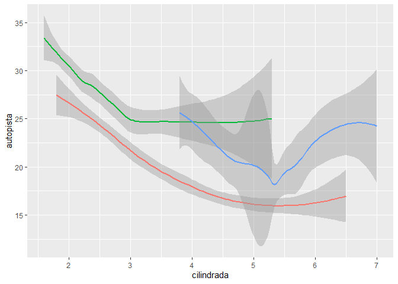
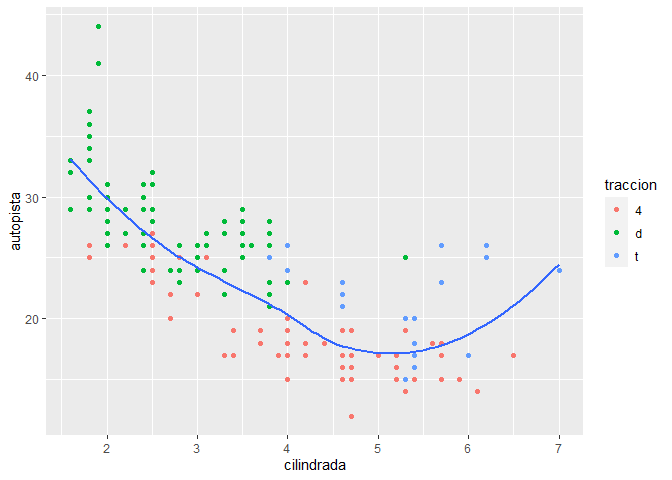
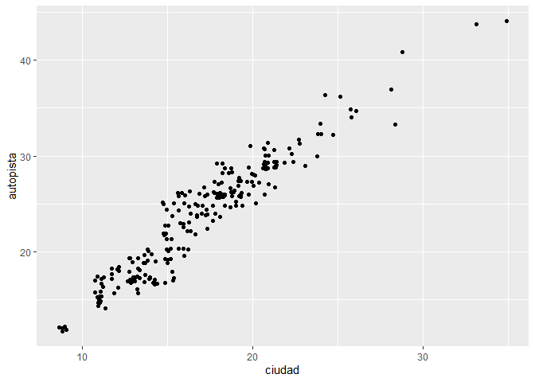
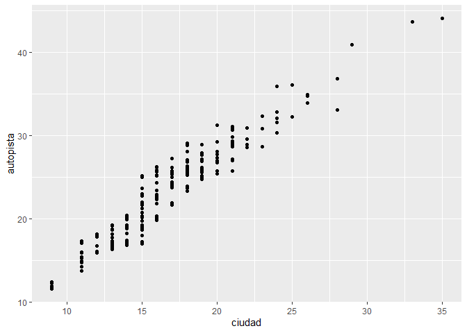
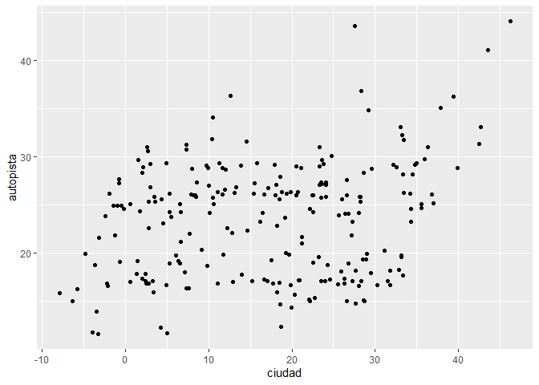
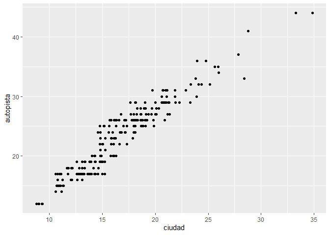
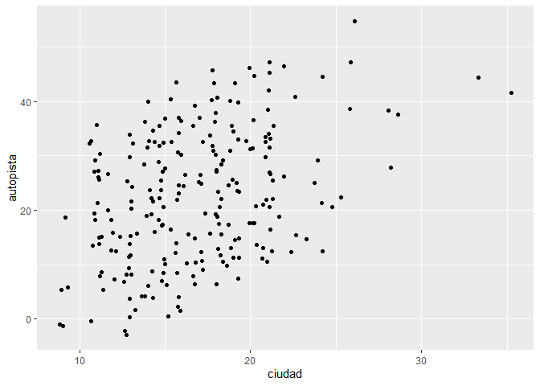
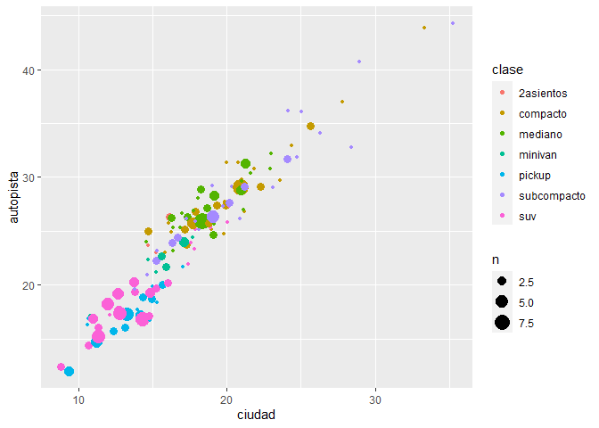
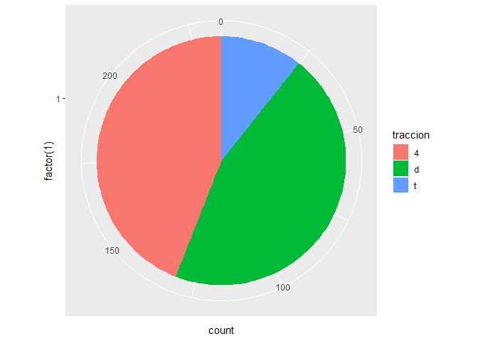
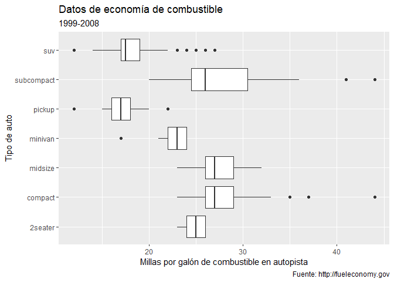

Ejercicios: ggplot2
================
Abby Celis
20/1/2022

# Ejercicios: ggplot2

``` r
library(ggplot2)
library(tidyverse)
```

    ## -- Attaching packages --------------------------------------- tidyverse 1.3.1 --

    ## v tibble  3.1.6     v dplyr   1.0.7
    ## v tidyr   1.1.4     v stringr 1.4.0
    ## v readr   2.1.1     v forcats 0.5.1
    ## v purrr   0.3.4

    ## -- Conflicts ------------------------------------------ tidyverse_conflicts() --
    ## x dplyr::filter() masks stats::filter()
    ## x dplyr::lag()    masks stats::lag()

``` r
library(datos)
millas
```

    ## # A tibble: 234 x 11
    ##    fabricante modelo     cilindrada  anio cilindros transmision traccion ciudad
    ##    <chr>      <chr>           <dbl> <int>     <int> <chr>       <chr>     <int>
    ##  1 audi       a4                1.8  1999         4 auto(l5)    d            18
    ##  2 audi       a4                1.8  1999         4 manual(m5)  d            21
    ##  3 audi       a4                2    2008         4 manual(m6)  d            20
    ##  4 audi       a4                2    2008         4 auto(av)    d            21
    ##  5 audi       a4                2.8  1999         6 auto(l5)    d            16
    ##  6 audi       a4                2.8  1999         6 manual(m5)  d            18
    ##  7 audi       a4                3.1  2008         6 auto(av)    d            18
    ##  8 audi       a4 quattro        1.8  1999         4 manual(m5)  4            18
    ##  9 audi       a4 quattro        1.8  1999         4 auto(l5)    4            16
    ## 10 audi       a4 quattro        2    2008         4 manual(m6)  4            20
    ## # ... with 224 more rows, and 3 more variables: autopista <int>,
    ## #   combustible <chr>, clase <chr>

PARTE 1: Ggplot base

Ejecuta ggplot(data = millas). ¿Qué observas?

¿Cuántas filas hay en millas? ¿Cuántas columnas?

¿Qué describe la variable traccion? Lee la ayuda de ?millas para
encontrar la respuesta.

Realiza un gráfico de dispersión de autopista versus cilindros.

¿Qué sucede cuando haces un gráfico de dispersión (scatterplot) de clase
versus traccion?

¿Por qué no es útil este gráfico?

PARTE 2: Mapeos estéticos

¿Qué no va bien en este código? ¿Por qué hay puntos que no son azules?

``` r
 ggplot(data = millas) +
   geom_point(mapping = aes(x = cilindrada, y = autopista, color = "blue"))
```

<!-- -->

¿Qué variables en millas son categóricas? ¿Qué variables son continuas?
(Pista: escribe ?millas para leer la documentación de ayuda para este
conjunto de datos). ¿Cómo puedes ver esta información cuando ejecutas
millas?

Asigna una variable continua a color, size, y shape. ¿Cómo se comportan
estas estéticas de manera diferente para variables categóricas y
variables continuas?

¿Qué ocurre si asignas o mapeas la misma variable a múltiples estéticas?

¿Qué hace la estética stroke? ¿Con qué formas trabaja? (Pista: consulta
?geom_point)

¿Qué ocurre si se asigna o mapea una estética a algo diferente del
nombre de una variable, como aes(color = cilindrada \< 5)?

Parte 3: Facetas

¿Qué ocurre si intentas separar en facetas una variable continua?

¿Qué significan las celdas vacías que aparecen en el gráfico generado
usando facet_grid(traccion \~ cilindros)? ¿Cómo se relacionan con este
gráfico?

``` r
ggplot(data = millas) +
  geom_point(mapping = aes(x = traccion, y = cilindros))
```

<!-- -->

¿Qué gráfica el siguiente código? ¿Qué hace?

``` r
ggplot(data = millas) +
  geom_point(mapping = aes(x = cilindrada, y = autopista)) +
  facet_grid(traccion ~ .)
```

<!-- -->

``` r
ggplot(data = millas) +
  geom_point(mapping = aes(x = cilindrada, y = autopista)) +
  facet_grid(. ~ cilindros)
```

<!-- -->

Mira de nuevo el primer gráfico en facetas presentado en esta sección:

``` r
ggplot(data = millas) +
  geom_point(mapping = aes(x = cilindrada, y = autopista)) +
  facet_wrap(~ clase, nrow = 2)
```

<!-- -->

¿Cuáles son las ventajas de separar en facetas en lugar de aplicar una
estética de color? ¿Cuáles son las desventajas? ¿Cómo cambiaría este
balance si tuvieras un conjunto de datos más grande? - Lee ?facet_wrap.
¿Qué hace nrow? ¿Qué hace ncol? ¿Qué otras opciones controlan el diseño
de los paneles individuales? ¿Por qué facet_grid() no tiene argumentos
nrow y ncol? - Cuando usas facet_grid(), generalmente deberías poner la
variable con un mayor número de niveles únicos en las columnas. ¿Por
qué?

Parte 4: Objetos geométricos

¿Qué geom usarías para generar un gráfico de líneas? ¿Y para un diagrama
de caja? ¿Y para un histograma? ¿Y para un gráfico de área?

Ejecuta este código en tu mente y predice cómo se verá el output. Luego,
ejecuta el código en R y verifica tus predicciones.

``` r
ggplot(data = millas, mapping = aes(x = cilindrada, y = autopista, color = traccion)) +
  geom_point() +
  geom_smooth(se = FALSE)
```

    ## `geom_smooth()` using method = 'loess' and formula 'y ~ x'

<!-- -->

¿Qué muestra show.legend = FALSE? ¿Qué pasa si lo quitas? ¿Por qué crees
que lo utilizamos antes en el capítulo?

¿Qué hace el argumento se en geom_smooth()?

¿Se verán distintos estos gráficos? ¿Por qué sí o por qué no?

``` r
ggplot(data = millas, mapping = aes(x = cilindrada, y = autopista)) +
  geom_point() +
  geom_smooth()
```

    ## `geom_smooth()` using method = 'loess' and formula 'y ~ x'

<!-- -->

``` r
ggplot() +
  geom_point(data = millas, mapping = aes(x = cilindrada, y = autopista)) +
  geom_smooth(data = millas, mapping = aes(x = cilindrada, y = autopista))
```

    ## `geom_smooth()` using method = 'loess' and formula 'y ~ x'

<!-- -->

Recrea el código R necesario para generar los siguientes gráficos:

Parte 5: Gráficos estadísticos

¿Cuál es el geom predeterminado asociado con stat_summary()? ¿Cómo
podrías reescribir el gráfico anterior para usar esa función geom en
lugar de la función stat?

¿Qué hace geom_col()? ¿En qué se diferencia de geom_bar()?

La mayoría de los geoms y las transformaciones estadísticas vienen en
pares que casi siempre se usan en conjunto. Lee la documentación y haz
una lista de todos los pares. ¿Qué tienen en común?

¿Qué variables calcula stat_smooth()? ¿Qué parámetros controlan su
comportamiento?

En nuestro gráfico de barras de proporción necesitamos establecer group
= 1. ¿Por qué? En otras palabras, ¿cuál es el problema con estos dos
gráficos?

Parte 6: Ajuste de posición

¿Cuál es el problema con este gráfico? ¿Cómo podrías mejorarlo?

``` r
ggplot(data = millas, mapping = aes(x = ciudad, y = autopista)) +
  geom_point()
```

<!-- -->

Podríamos usar `position = "jitter"` para añadir ruido a nuestros
puntos:

``` r
ggplot(data = millas, mapping = aes(x = ciudad, y = autopista)) +
  geom_point(position = "jitter")
```

<!-- -->

¿Qué parámetros de geom_jitter() controlan la cantidad de ruido?

Parámetros:

width: eje horizontal height: eje vertical

``` r
ggplot(data = millas, mapping = aes(x = ciudad, y = autopista)) +
  geom_jitter(width = 0)
```

<!-- -->

``` r
ggplot(data = millas, mapping = aes(x = ciudad, y = autopista)) +
  geom_jitter(width = 20)
```

<!-- -->

``` r
ggplot(data = millas, mapping = aes(x = ciudad, y = autopista)) +
  geom_jitter(height = 0)
```

<!-- -->

``` r
ggplot(data = millas, mapping = aes(x = ciudad, y = autopista)) +
  geom_jitter(height = 20)
```

<!-- -->

Compara y contrasta geom_jitter() con geom_count()

``` r
ggplot(data = millas, mapping = aes(x = ciudad, y = autopista)) +
  geom_jitter()
```

<!-- -->

``` r
ggplot(data = millas, mapping = aes(x = ciudad, y = autopista)) +
  geom_count()
```

<!-- -->

``` r
ggplot(data = millas, mapping = aes(x = ciudad, y = autopista, color = clase)) +
  geom_count(position = "jitter")
```

<!-- -->

¿Cuál es el ajuste de posición predeterminado de geom_boxplot()? Crea
una visualización del conjunto de datos de millas que lo demuestre.

``` r
?geom_boxplot()
```

    ## starting httpd help server ... done

``` r
ggplot(data = millas, mapping = aes(x = ciudad, y = autopista, color = clase)) +
  geom_boxplot()
```

<!-- -->

``` r
ggplot(data = millas, mapping = aes(x = ciudad, y = autopista, color = clase)) +
  geom_boxplot(position = "identity")
```

<!-- -->

Parte 7: Sistema de coordenadas

Convierte un gráfico de barras apiladas en un gráfico circular usando
coord_polar().

``` r
ggplot(millas, aes(x = factor(1), fill = traccion)) +
  geom_bar()
```

<!-- -->

``` r
ggplot(millas, aes(x = factor(1), fill = traccion)) +
  geom_bar(width = 1) +
  coord_polar(theta = "y")
```

<!-- -->

¿Qué hace labs()? Lee la documentación.

``` r
?labs
ggplot(data = mpg, mapping = aes(x = class, y = hwy)) +
  geom_boxplot() +
  coord_flip() +
  labs(y = "Millas por galón de combustible en autopista",
       x = "Tipo de auto",
       title = "Datos de economía de combustible",
       subtitle = "1999-2008",
       caption = "Fuente: http://fueleconomy.gov")
```

<!-- -->

¿Cuál es la diferencia entre coord_quickmap() y coord_map()?

``` r
?coord_quickmap
  ?coord_map
```

¿Qué te dice la gráfica siguiente sobre la relación entre ciudad y
autopista? ¿Por qué es coord_fixed() importante? ¿Qué hace
geom_abline()?

``` r
ggplot(data = millas, mapping = aes(x = ciudad, y = autopista)) +
  geom_point() +
  geom_abline() +
  coord_fixed()
```

<!-- -->

``` r
?coord_fixed
?geom_abline
```
