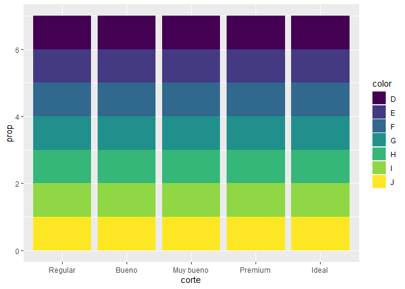
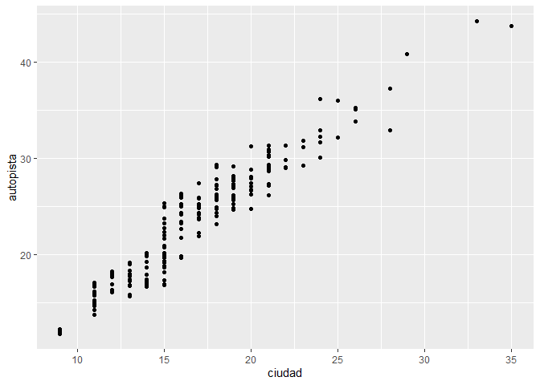
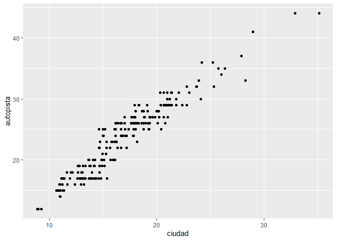
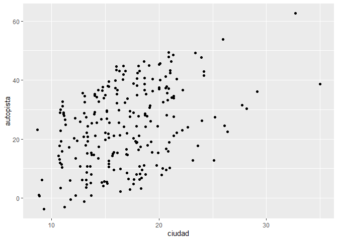
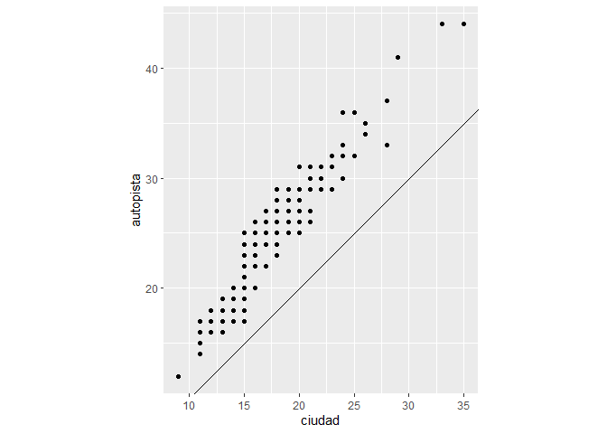

Ejercicios: ggplot2
================
Abby Celis
20/1/2022

# Ejercicios: ggplot2

``` r
library(ggplot2)
library(tidyverse)
```

    ## -- Attaching packages --------------------------------------- tidyverse 1.3.1 --

    ## v tibble  3.1.6     v dplyr   1.0.7
    ## v tidyr   1.1.4     v stringr 1.4.0
    ## v readr   2.1.1     v forcats 0.5.1
    ## v purrr   0.3.4

    ## -- Conflicts ------------------------------------------ tidyverse_conflicts() --
    ## x dplyr::filter() masks stats::filter()
    ## x dplyr::lag()    masks stats::lag()

``` r
library(datos)
millas
```

    ## # A tibble: 234 x 11
    ##    fabricante modelo     cilindrada  anio cilindros transmision traccion ciudad
    ##    <chr>      <chr>           <dbl> <int>     <int> <chr>       <chr>     <int>
    ##  1 audi       a4                1.8  1999         4 auto(l5)    d            18
    ##  2 audi       a4                1.8  1999         4 manual(m5)  d            21
    ##  3 audi       a4                2    2008         4 manual(m6)  d            20
    ##  4 audi       a4                2    2008         4 auto(av)    d            21
    ##  5 audi       a4                2.8  1999         6 auto(l5)    d            16
    ##  6 audi       a4                2.8  1999         6 manual(m5)  d            18
    ##  7 audi       a4                3.1  2008         6 auto(av)    d            18
    ##  8 audi       a4 quattro        1.8  1999         4 manual(m5)  4            18
    ##  9 audi       a4 quattro        1.8  1999         4 auto(l5)    4            16
    ## 10 audi       a4 quattro        2    2008         4 manual(m6)  4            20
    ## # ... with 224 more rows, and 3 more variables: autopista <int>,
    ## #   combustible <chr>, clase <chr>

PARTE 1: Ggplot base

Ejecuta `ggplot(data = millas)`. ¿Qué observas?

``` r
ggplot(data = millas)
```

<!-- -->

Este código crea un gráfico en blanco. Solo se ve el fondo, pero no se
dibuja nada sobre él, ya que las otras dos capas mínimas no se han
especificado: variables de mapeo `aes()` y `geom_*()` que indica la
representación gráfica a utilizar.

¿Cuántas filas hay en `millas`? ¿Cuántas columnas?

``` r
nrow(millas)
```

    ## [1] 234

``` r
ncol(millas) 
```

    ## [1] 11

¿Qué describe la variable `traccion`? Lee la ayuda de `?millas` para
encontrar la respuesta.

``` r
unique(millas$traccion)
```

    ## [1] "d" "4" "t"

Realiza un gráfico de dispersión de `autopista` versus `cilindros`.

``` r
ggplot(millas, aes(x = autopista, y = cilindros)) +
  geom_point()
```

<!-- -->

¿Qué sucede cuando haces un gráfico de dispersión (scatterplot) de
`clase` versus `traccion`?

``` r
ggplot(millas, aes(x = clase, y = traccion)) +
  geom_point()
```

<!-- -->

¿Por qué no es útil este gráfico?

El gráfico no tiene tantos puntos.

PARTE 2: Mapeos estéticos

¿Qué no va bien en este código? ¿Por qué hay puntos que no son azules?

``` r
 ggplot(data = millas) +
   geom_point(mapping = aes(x = cilindrada, y = autopista, color = "blue"))
```

<!-- -->

Se debe cambiar el orden de los parámetros para tener los puntos en
color azul.

``` r
ggplot(data = millas) +
     geom_point(mapping = aes(x = cilindrada, y = autopista), color = "blue")
```

<!-- -->

¿Qué variables en `millas` son categóricas? ¿Qué variables son
continuas? (Pista: escribe `?millas` para leer la documentación de ayuda
para este conjunto de datos). ¿Cómo puedes ver esta información cuando
ejecutas `millas`?

Variables categóricas: modelo, transmisión, tracción, combustible y
clase. Variables continuas: cilindrada, cilindros, ciudad, autopista.

Asigna una variable continua a `color`, `size`, y `shape`. ¿Cómo se
comportan estas estéticas de manera diferente para variables categóricas
y variables continuas?

``` r
ggplot(millas, aes(x = cilindrada, y = autopista, colour = ciudad)) +
  geom_point()
```

<!-- -->

¿Qué ocurre si asignas o mapeas la misma variable a múltiples estéticas?

Se va generar un gráfico con información repitente.

``` r
ggplot(millas, aes(x = cilindrada, y = autopista, colour = autopista, size = autopista)) +
  geom_point()
```

<!-- -->

¿Qué hace la estética `stroke`? ¿Con qué formas trabaja? (Pista:
consulta `?geom_point`)

Cambia el tamaño de los bordes de las formas.

``` r
ggplot(mtautos, aes(peso, millas)) +
  geom_point(shape = 21, colour = "black", fill = "white", size = 5, stroke = 5)
```

<!-- -->

¿Qué ocurre si se asigna o mapea una estética a algo diferente del
nombre de una variable, como `aes(color = cilindrada < 5)`?

``` r
ggplot(millas, aes(x = cilindrada, y = autopista, colour = cilindrada < 5)) +
  geom_point()
```

<!-- -->

Parte 3: Facetas

¿Qué ocurre si intentas separar en facetas una variable continua?

La variable continua es convertida a una variable categórica

¿Qué significan las celdas vacías que aparecen en el gráfico generado
usando `facet_grid(traccion ~ cilindros)`? ¿Cómo se relacionan con este
gráfico?

``` r
ggplot(data = millas) +
  geom_point(mapping = aes(x = traccion, y = cilindros))
```

<!-- -->

Son las mismas ubicaciones en el gráfico de dispersión de `autopista` y
`ciudad` que no tienen gráfica.

``` r
ggplot(data = millas) +
  geom_point(mapping = aes(x = autopista, y = ciudad))
```

<!-- -->

¿Qué gráfica el siguiente código? ¿Qué hace?

``` r
ggplot(data = millas) +
  geom_point(mapping = aes(x = cilindrada, y = autopista)) +
  facet_grid(traccion ~ .)
```

<!-- -->

``` r
ggplot(data = millas) +
  geom_point(mapping = aes(x = cilindrada, y = autopista)) +
  facet_grid(. ~ cilindros)
```

<!-- -->

`autopista ~ .` divide por los valores de `autopista` en el eje y.

Mira de nuevo el primer gráfico en facetas presentado en esta sección:

``` r
ggplot(data = millas) +
  geom_point(mapping = aes(x = cilindrada, y = autopista)) +
  facet_wrap(~ clase, nrow = 2)
```

<!-- -->

Parte 4: Objetos geométricos

¿Qué geom usarías para generar un gráfico de líneas? ¿Y para un diagrama
de caja? ¿Y para un histograma? ¿Y para un gráfico de área?

Gráfico de líneas: `geom_line()` Diagrama de caja: `geom_boxplot()`
Histograma: `geom_histogram()` Gráfico de área: `geom_area()`

Ejecuta este código en tu mente y predice cómo se verá el output. Luego,
ejecuta el código en R y verifica tus predicciones.

``` r
ggplot(data = millas, mapping = aes(x = cilindrada, y = autopista, color = traccion)) +
  geom_point() +
  geom_smooth(se = FALSE)
```

    ## `geom_smooth()` using method = 'loess' and formula 'y ~ x'

<!-- -->

El resultado es un diagrama de dispersión con `cilindrada` en el eje x,
`autopista` en el eje y y los puntos pintados de acuerdo a `traccion`.

¿Qué muestra `show.legend = FALSE`? ¿Qué pasa si lo quitas? ¿Por qué
crees que lo utilizamos antes en el capítulo?

`show.legend = FALSE` oculta la leyenda.

``` r
ggplot(data = millas) +
  geom_smooth(
    mapping = aes(x = cilindrada, y = autopista, colour = traccion),
    show.legend = FALSE
  )
```

    ## `geom_smooth()` using method = 'loess' and formula 'y ~ x'

<!-- -->

¿Qué hace el argumento se en `geom_smooth()`?

Agrega las bandas de error estándar a las líneas.

``` r
ggplot(data = millas, mapping = aes(x = cilindrada, y = autopista, colour = traccion)) +
  geom_point() +
  geom_smooth(se = TRUE)
```

    ## `geom_smooth()` using method = 'loess' and formula 'y ~ x'

<!-- -->

¿Se verán distintos estos gráficos? ¿Por qué sí o por qué no?

``` r
ggplot(data = millas, mapping = aes(x = cilindrada, y = autopista)) +
  geom_point() +
  geom_smooth()
```

    ## `geom_smooth()` using method = 'loess' and formula 'y ~ x'

<!-- -->

``` r
ggplot() +
  geom_point(data = millas, mapping = aes(x = cilindrada, y = autopista)) +
  geom_smooth(data = millas, mapping = aes(x = cilindrada, y = autopista))
```

    ## `geom_smooth()` using method = 'loess' and formula 'y ~ x'

<!-- -->

No se ven distintos. `geom_point()` y `geom_smooth()` toman los datos y
estéticas de `ggplot()`

Recrea el código R necesario para generar los siguientes gráficos:

``` r
ggplot(data = millas, mapping = aes(x = cilindrada, y = autopista)) +
   geom_point() +
   geom_smooth(se = FALSE)
```

    ## `geom_smooth()` using method = 'loess' and formula 'y ~ x'

<!-- -->

``` r
ggplot(data = millas, mapping = aes(x = cilindrada, y = autopista)) +
   geom_smooth(aes(group = traccion), se = FALSE) +
   geom_point()
```

    ## `geom_smooth()` using method = 'loess' and formula 'y ~ x'

<!-- -->

``` r
ggplot(data = millas, mapping = aes(x = cilindrada, y = autopista, color = traccion)) +
   geom_point() +
   geom_smooth(se = FALSE)
```

    ## `geom_smooth()` using method = 'loess' and formula 'y ~ x'

<!-- -->

``` r
ggplot(data = millas, mapping = aes(x = cilindrada, y = autopista)) +
   geom_point(aes(color = traccion)) +
   geom_smooth(se = FALSE)
```

    ## `geom_smooth()` using method = 'loess' and formula 'y ~ x'

<!-- -->

``` r
ggplot(data = millas, mapping = aes(x = cilindrada, y = autopista)) +
   geom_point(aes(color = traccion)) +
   geom_smooth(aes(linetype = traccion), se = FALSE)
```

    ## `geom_smooth()` using method = 'loess' and formula 'y ~ x'

<!-- -->

``` r
ggplot(data = millas, mapping = aes(x = cilindrada, y = autopista)) +
   geom_point(size = 4, colour = "white") +
   geom_point(aes(colour = traccion))
```

<!-- -->

Parte 5: Gráficos estadísticos

¿Cuál es el geom predeterminado asociado con `stat_summary()`? ¿Cómo
podrías reescribir el gráfico anterior para usar esa función geom en
lugar de la función stat?

``` r
ggplot(data = diamantes) +
  stat_summary(
    mapping = aes(x = corte, y = profundidad),
    fun.ymin = min,
    fun.ymax = max,
    fun.y = median
  )
```

    ## Warning: `fun.y` is deprecated. Use `fun` instead.

    ## Warning: `fun.ymin` is deprecated. Use `fun.min` instead.

    ## Warning: `fun.ymax` is deprecated. Use `fun.max` instead.

<!-- -->

¿Qué hace `geom_col()`? ¿En qué se diferencia de `geom_bar()`?

`geom_col()` usa `stat_identity()`, que deja los datos sin transformar.

`geom_col()` espera que los datos contengan los valores de `x` y los
valores de `y` que representan la altura de las columnas.

`geom_bar()` usa `stat_bin()` y espera los valores de `x`.

La mayoría de los geoms y las transformaciones estadísticas vienen en
pares que casi siempre se usan en conjunto. Lee la documentación y haz
una lista de todos los pares. ¿Qué tienen en común?

| Geometría           | Estadístico         |
|---------------------|---------------------|
| `geom_bar()`        | `stat_count()`      |
| `geom_bin2d()`      | `stat_bin_2d()`     |
| `geom_boxplot()`    | `stat_boxplot()`    |
| `geom_contour()`    | `stat_contour()`    |
| `geom_count()`      | `stat_sum()`        |
| `geom_density()`    | `stat_density()`    |
| `geom_density_2d()` | `stat_density_2d()` |
| `geom_hex()`        | `stat_hex()`        |
| `geom_freqpoly()`   | `stat_bin()`        |
| `geom_histogram()`  | `stat_bin()`        |
| `geom_qq_line()`    | `stat_qq_line()`    |
| `geom_qq()`         | `stat_qq()`         |
| `geom_quantile()`   | `stat_quantile()`   |
| `geom_smooth()`     | `stat_smooth()`     |
| `geom_violin()`     | `stat_violin()`     |
| `geom_sf()`         | `stat_sf()`         |

En nuestro gráfico de barras de proporción necesitamos establecer
`group = 1`. ¿Por qué? En otras palabras, ¿cuál es el problema con estos
dos gráficos?

``` r
ggplot(data = diamantes) +
   geom_bar(mapping = aes(x = corte, y = ..prop..))
```

<!-- -->

``` r
ggplot(data = diamantes) +
   geom_bar(mapping = aes(x = corte, fill = color, y = ..prop..))
```

<!-- -->

El problema con estos gráficos es que las proporciones se calculan
dentro de los grupos.

Parte 6: Ajuste de posición

¿Cuál es el problema con este gráfico? ¿Cómo podrías mejorarlo?

``` r
ggplot(data = millas, mapping = aes(x = ciudad, y = autopista)) +
  geom_point()
```

<!-- -->

Podríamos usar `position = "jitter"` para añadir ruido a nuestros
puntos:

``` r
ggplot(data = millas, mapping = aes(x = ciudad, y = autopista)) +
  geom_point(position = "jitter")
```

<!-- -->

¿Qué parámetros de geom_jitter() controlan la cantidad de ruido?

Parámetros:

width: eje horizontal height: eje vertical

``` r
ggplot(data = millas, mapping = aes(x = ciudad, y = autopista)) +
  geom_jitter(width = 0)
```

<!-- -->

``` r
ggplot(data = millas, mapping = aes(x = ciudad, y = autopista)) +
  geom_jitter(width = 20)
```

<!-- -->

``` r
ggplot(data = millas, mapping = aes(x = ciudad, y = autopista)) +
  geom_jitter(height = 0)
```

<!-- -->

``` r
ggplot(data = millas, mapping = aes(x = ciudad, y = autopista)) +
  geom_jitter(height = 20)
```

<!-- -->

Compara y contrasta geom_jitter() con geom_count()

``` r
ggplot(data = millas, mapping = aes(x = ciudad, y = autopista)) +
  geom_jitter()
```

<!-- -->

``` r
ggplot(data = millas, mapping = aes(x = ciudad, y = autopista)) +
  geom_count()
```

<!-- -->

``` r
ggplot(data = millas, mapping = aes(x = ciudad, y = autopista, color = clase)) +
  geom_count(position = "jitter")
```

<!-- -->

¿Cuál es el ajuste de posición predeterminado de geom_boxplot()? Crea
una visualización del conjunto de datos de millas que lo demuestre.

``` r
?geom_boxplot()
```

    ## starting httpd help server ... done

``` r
ggplot(data = millas, mapping = aes(x = ciudad, y = autopista, color = clase)) +
  geom_boxplot()
```

<!-- -->

``` r
ggplot(data = millas, mapping = aes(x = ciudad, y = autopista, color = clase)) +
  geom_boxplot(position = "identity")
```

<!-- -->

Parte 7: Sistema de coordenadas

Convierte un gráfico de barras apiladas en un gráfico circular usando
coord_polar().

``` r
ggplot(millas, aes(x = factor(1), fill = traccion)) +
  geom_bar()
```

<!-- -->

``` r
ggplot(millas, aes(x = factor(1), fill = traccion)) +
  geom_bar(width = 1) +
  coord_polar(theta = "y")
```

<!-- -->

¿Qué hace labs()? Lee la documentación.

``` r
?labs
ggplot(data = mpg, mapping = aes(x = class, y = hwy)) +
  geom_boxplot() +
  coord_flip() +
  labs(y = "Millas por galón de combustible en autopista",
       x = "Tipo de auto",
       title = "Datos de economía de combustible",
       subtitle = "1999-2008",
       caption = "Fuente: http://fueleconomy.gov")
```

<!-- -->

¿Cuál es la diferencia entre coord_quickmap() y coord_map()?

``` r
?coord_quickmap
  ?coord_map
```

¿Qué te dice la gráfica siguiente sobre la relación entre ciudad y
autopista? ¿Por qué es coord_fixed() importante? ¿Qué hace
geom_abline()?

``` r
ggplot(data = millas, mapping = aes(x = ciudad, y = autopista)) +
  geom_point() +
  geom_abline() +
  coord_fixed()
```

<!-- -->

La funcion `coord_fixed()` asegura que la linea que genera
`geom_abline()` tenga un angulo de 45 grados. De este modo es mas facil
comparar a partir de los casos en que los rendimientos en autopista y
ciudad son iguales.

``` r
?coord_fixed
?geom_abline
```

``` r
ggplot(data = millas, mapping = aes(x = ciudad, y = autopista)) +
  geom_point() +
  geom_abline() +
  coord_fixed()
```

<!-- -->

Lo que podemos ver es que en todos los modelos el rendimiento en
autopista es superior al rendmiento en ciudad.
