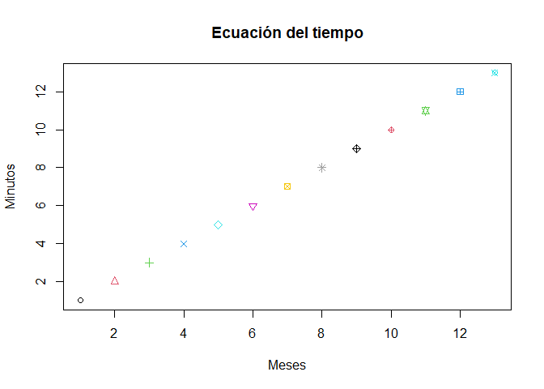

Tarea 2
================
Abby Celis
24/11/2021

TAREA 2 MARKDOWN GRUPO 5

# Ejercicio 1

## ¿Qúe cantidad de dinero sobra al repartir 10000$ entre 3 personas?

``` r
10000 %% 3
```

    ## [1] 1

# Ejercicio 2

## ¿Es el ńumero 4560 divisible por 3?

``` r
4560 %% 3
```

    ## [1] 0

# Ejercicio 3

## Construya un vector con los ńumeros enteros del 2 al 87. ¿Cu ́ales de esos ńumeros son divisibles por 7?

``` r
x <- 2:87
x [x%%7== 0]
```

    ##  [1]  7 14 21 28 35 42 49 56 63 70 77 84

# Ejercicio 4

## Construya dos vectores, el primero con los ńumeros enteros desde 7 hasta 3, el segundo vector con los primeros cinco ńumeros positivos divisibles por 5.

``` r
c(3:7)
```

    ## [1] 3 4 5 6 7

``` r
c(0,5,10,15,20)
```

    ## [1]  0  5 10 15 20

# Ejercicio 5

## Consulte este link en el cual hay una ańectoda de Gauss n ̃no. Use R para obtener el resultado de la suma solicitada por el profesor del nĩno Gauss.

``` r
x <- 1:100
sum(x)
```

    ## [1] 5050

# Ejercicio 6

## Construya un vector con los siguientes elementos: 1, -4, 5, 9, -4. Escriba un procedimiento para extraer las posiciones donde est́a el valor m ́ınimo en el vector.

``` r
Vec <- c(1,-4,5,9,-4)
which.min(Vec)
```

    ## [1] 2

# Ejercicio 7

## Calcular 8!

``` r
factorial(8)
```

    ## [1] 40320

# Ejercicio 8

## Evaluar la siguiente sumatoria

``` r
sumatoria <- c(3,4,5,6,7)
for (x in sumatoria) {
  exponente <- exp(x)
  print(exponente)
}
```

    ## [1] 20.08554
    ## [1] 54.59815
    ## [1] 148.4132
    ## [1] 403.4288
    ## [1] 1096.633

# Ejercicio 9

## Evaluar la siguiente productoria

``` r
x<- log(sqrt(1)):log(sqrt(10))
prod(x)
```

    ## [1] 0

# Ejercicio 10

## Realizar una función que permita calcular el área de una corona circular.

``` r
Areacorona <- function(x,y){
  ((x)^2)/2*(y-sin(y))
}
Areacorona(4,pi/4)
```

    ## [1] 0.6263311

# Ejercicio 11

# Construya un vector cualquiera e inviertalo, es decir, que el primer elemento quede dé ultimo, el segundo de penúltimo y así sucesivamente. Compare su resultado con el de la funcíon rev

``` r
sort(c(1:10),decreasing = T)
```

    ##  [1] 10  9  8  7  6  5  4  3  2  1

``` r
vector_11 <- c(1:10)
sort(vector_11,decreasing = T)
```

    ##  [1] 10  9  8  7  6  5  4  3  2  1

``` r
rev(vector_11)
```

    ##  [1] 10  9  8  7  6  5  4  3  2  1

# Ejercicio 12

## Calcular lo siguiente

``` r
n <-c(10:100)
n^3+(4*n^2)
```

    ##  [1]    1400    1815    2304    2873    3528    4275    5120    6069    7128
    ## [10]    8303    9600   11025   12584   14283   16128   18125   20280   22599
    ## [19]   25088   27753   30600   33635   36864   40293   43928   47775   51840
    ## [28]   56129   60648   65403   70400   75645   81144   86903   92928   99225
    ## [37]  105800  112659  119808  127253  135000  143055  151424  160113  169128
    ## [46]  178475  188160  198189  208568  219303  230400  241865  253704  265923
    ## [55]  278528  291525  304920  318719  332928  347553  362600  378075  393984
    ## [64]  410333  427128  444375  462080  480249  498888  518003  537600  557685
    ## [73]  578264  599343  620928  643025  665640  688779  712448  736653  761400
    ## [82]  786695  812544  838953  865928  893475  921600  950309  979608 1009503
    ## [91] 1040000

``` r
sum(n^3+(4*n^2))
```

    ## [1] 26852735

# Ejercicio 13

## Calcular lo siguiente

``` r
i <- 1:25
1:25
```

    ##  [1]  1  2  3  4  5  6  7  8  9 10 11 12 13 14 15 16 17 18 19 20 21 22 23 24 25

``` r
n <- (2^i)/i
o <- (3^i)/i^2

sum(o+n)
```

    ## [1] 2129170437

# Ejercicio 14

## Lea el siguiente archivo

``` r
datos <- read.csv("https://raw.githubusercontent.com/fhernanb/datos/master/Paises.txt")
datos
```

    ##     Pais.poblacion.alfabetizacion.tasamortinf.PIB
    ## 1                      Acerbaján_\t7400\t98\t35\t3000
    ## 2                     Afganistán\t20500\t29\t168\t205
    ## 3                     Alemania\t81200\t99\t6.5\t17539
    ## 4                   Arabia_Saudí\t18000\t62\t52\t6651
    ## 5                   Argentina_\t33900\t95\t25.6\t3408
    ## 6                        Armenia_\t3700\t98\t27\t5000
    ## 7                  Australia_\t17800\t100\t7.3\t16848
    ## 8                      Austria_\t8000\t99\t6.7\t18396
    ## 9                         Bahrein_\t600\t77\t25\t7875
    ## 10                   Bangladesh\t125000\t35\t106\t202
    ## 11                      Barbados\t256\t99\t20.3\t6950
    ## 12                    Bélgica_\t10100\t99\t7.2\t17912
    ## 13                    Bielorusia\t10300\t99\t19\t6500
    ## 14                        Bolivia_\t7900\t78\t75\t730
    ## 15                       Bosnia\t4600\t86\t12.7\t3098
    ## 16                     Botswana\t1359\t72\t39.3\t2677
    ## 17                       Brasil\t156600\t81\t66\t2354
    ## 18                       Bulgaria\t8900\t93\t12\t3831
    ## 19                  Burkina_Faso\t10000\t18\t118\t357
    ## 20                       Burundi_\t6000\t50\t105\t208
    ## 21                      Camboya_\t10000\t35\t112\t260
    ## 22                       Camerún_\t13100\t54\t77\t993
    ## 23                      Canadá\t29100\t97\t6.8\t19904
    ## 24                      Chile_\t14000\t93\t14.6\t2591
    ## 25                       China_\t1205200\t78\t52\t377
    ## 26                      Colombia\t35600\t87\t28\t1538
    ## 27            Corea_del_Norte_\t23100\t99\t27.7\t1000
    ## 28              Corea_del_Sur_\t45000\t96\t21.7\t6627
    ## 29                     Costa_Rica\t3300\t93\t11\t2031
    ## 30                      Croacia_\t4900\t97\t8.7\t5487
    ## 31                        Cuba\t11100\t94\t10.2\t1382
    ## 32                   Dinamarca_\t5200\t99\t6.6\t18277
    ## 33                      Ecuador_\t10700\t88\t39\t1085
    ## 34                       Egipto\t60000\t48\t76.4\t748
    ## 35                   El_Salvador_\t5800\t73\t41\t1078
    ## 36              Emiratos_Árabes_\t2800\t68\t22\t14193
    ## 37                      España\t39200\t95\t6.9\t13047
    ## 38             Estados_Unidos\t260800\t97\t8.1\t23474
    ## 39                       Estonia_\t1600\t99\t19\t6000
    ## 40                      Etiopía_\t55200\t24\t110\t122
    ## 41                     Filipinas_\t69800\t90\t51\t867
    ## 42                  Finlandia_\t5100\t100\t5.3\t15877
    ## 43                    Francia_\t58000\t99\t6.7\t18944
    ## 44                         Gabón_\t1300\t61\t94\t4283
    ## 45                          Gambia\t959\t27\t124\t351
    ## 46                       Georgia_\t5500\t99\t23\t4500
    ## 47                Gran_Bretaña\t58400\t99\t7.2\t15974
    ## 48                       Grecia\t10400\t93\t8.2\t8060
    ## 49                    Guatemala_\t10300\t55\t57\t1342
    ## 50                         Haití_\t6500\t53\t109\t383
    ## 51                       Honduras\t5600\t73\t45\t1030
    ## 52                   Hong_Kong_\t5800\t77\t5.8\t14641
    ## 53                      Hungía\t10500\t99\t12.5\t5249
    ## 54                        India_\t911600\t52\t79\t275
    ## 55                    Indonesia_\t199700\t77\t68\t681
    ## 56                          Irán\t65600\t54\t60\t1500
    ## 57                          Iraq\t19900\t60\t67\t1955
    ## 58                     Irlanda_\t3600\t98\t7.4\t12170
    ## 59                       Islandia\t263\t100\t4\t17241
    ## 60                       Israel\t5400\t92\t8.6\t13066
    ## 61                      Italia\t58100\t97\t7.6\t17500
    ## 62                     Japón_\t125500\t99\t4.4\t19860
    ## 63                       Jordania\t3961\t80\t34\t1157
    ## 64                         Kenia_\t28200\t69\t74\t323
    ## 65                       Kuwait\t1800\t73\t12.5\t6818
    ## 66                     Letonia_\t2700\t99\t21.5\t7400
    ## 67                       Líbano\t3620\t80\t39.5\t1429
    ## 68                       Liberia_\t2900\t40\t113\t409
    ## 69                         Libia_\t5500\t64\t63\t5910
    ## 70                       Lituania\t3800\t99\t17\t6710
    ## 71                    Malasia_\t19500\t78\t25.6\t2995
    ## 72                    Marruecos_\t28600\t50\t50\t1062
    ## 73                        México\t91800\t87\t35\t3604
    ## 74                    Nicaragua_\t4100\t57\t52.5\t447
    ## 75                       Nigeria_\t98100\t51\t75\t282
    ## 76                     Noruega_\t4300\t99\t6.3\t17755
    ## 77               Nueva_Zelanda_\t3524\t99\t8.9\t14381
    ## 78                Países_Bajos\t15400\t99\t6.3\t17245
    ## 79                     Pakistán\t128100\t35\t101\t406
    ## 80                       Panamá\t2600\t88\t16.5\t2397
    ## 81                     Paraguay\t5200\t90\t25.2\t1500
    ## 82                          Perú\t23650\t85\t54\t1107
    ## 83                    Polonia_\t38600\t99\t13.8\t4429
    ## 84                     Portugal\t10500\t85\t9.2\t9000
    ## 85               Rep._C._Africana\t3300\t27\t137\t457
    ## 86             Rep._Dominicana_\t7800\t83\t51.5\t1034
    ## 87                         Ruanda\t8400\t50\t117\t292
    ## 88                    Rumanía_\t23400\t96\t20.3\t2702
    ## 89                       Rusia_\t149200\t99\t27\t6680
    ## 90                        Senegal_\t8700\t38\t76\t744
    ## 91                     Singapur\t2900\t88\t5.7\t14990
    ## 92                        Siria_\t14900\t64\t43\t2436
    ## 93                      Somalia_\t6667\t24\t126\t2126
    ## 94                  Sudáfrica_\t43900\t76\t47.1\t3128
    ## 95                       Suecia\t8800\t99\t5.7\t16900
    ## 96                       Suiza_\t7000\t99\t6.2\t22384
    ## 97                    Tailandia_\t59400\t93\t37\t1800
    ## 98                       Taiwan\t20944\t91\t5.1\t7055
    ## 99                      Tanzania\t29800\t46\t110\t263
    ## 100                     Turquía_\t62200\t81\t49\t3721
    ## 101                   Ucrania_\t51800\t97\t20.7\t2340
    ## 102                       Uganda\t19800\t48\t112\t325
    ## 103                      Uruguay_\t3200\t96\t17\t3131
    ## 104                   Uzbekistán\t22600\t97\t53\t1350
    ## 105                   Venezuela_\t20600\t88\t28\t2829
    ## 106                      Vietnam_\t73100\t88\t46\t230
    ## 107                         Zambia\t9100\t73\t85\t573

# Ejercicio 15

## En R hay unas bases de datos incluídas, una de ellas es la base de datos llamada mtcars. Para conocer las variables que están en mtcars usted puede escribir en la consola ?mtcars o también help(mtcars). De la base mtcars obtenga bases de datos que cumplan las siguientes condiciones.

``` r
mtcars
```

    ##                      mpg cyl  disp  hp drat    wt  qsec vs am gear carb
    ## Mazda RX4           21.0   6 160.0 110 3.90 2.620 16.46  0  1    4    4
    ## Mazda RX4 Wag       21.0   6 160.0 110 3.90 2.875 17.02  0  1    4    4
    ## Datsun 710          22.8   4 108.0  93 3.85 2.320 18.61  1  1    4    1
    ## Hornet 4 Drive      21.4   6 258.0 110 3.08 3.215 19.44  1  0    3    1
    ## Hornet Sportabout   18.7   8 360.0 175 3.15 3.440 17.02  0  0    3    2
    ## Valiant             18.1   6 225.0 105 2.76 3.460 20.22  1  0    3    1
    ## Duster 360          14.3   8 360.0 245 3.21 3.570 15.84  0  0    3    4
    ## Merc 240D           24.4   4 146.7  62 3.69 3.190 20.00  1  0    4    2
    ## Merc 230            22.8   4 140.8  95 3.92 3.150 22.90  1  0    4    2
    ## Merc 280            19.2   6 167.6 123 3.92 3.440 18.30  1  0    4    4
    ## Merc 280C           17.8   6 167.6 123 3.92 3.440 18.90  1  0    4    4
    ## Merc 450SE          16.4   8 275.8 180 3.07 4.070 17.40  0  0    3    3
    ## Merc 450SL          17.3   8 275.8 180 3.07 3.730 17.60  0  0    3    3
    ## Merc 450SLC         15.2   8 275.8 180 3.07 3.780 18.00  0  0    3    3
    ## Cadillac Fleetwood  10.4   8 472.0 205 2.93 5.250 17.98  0  0    3    4
    ## Lincoln Continental 10.4   8 460.0 215 3.00 5.424 17.82  0  0    3    4
    ## Chrysler Imperial   14.7   8 440.0 230 3.23 5.345 17.42  0  0    3    4
    ## Fiat 128            32.4   4  78.7  66 4.08 2.200 19.47  1  1    4    1
    ## Honda Civic         30.4   4  75.7  52 4.93 1.615 18.52  1  1    4    2
    ## Toyota Corolla      33.9   4  71.1  65 4.22 1.835 19.90  1  1    4    1
    ## Toyota Corona       21.5   4 120.1  97 3.70 2.465 20.01  1  0    3    1
    ## Dodge Challenger    15.5   8 318.0 150 2.76 3.520 16.87  0  0    3    2
    ## AMC Javelin         15.2   8 304.0 150 3.15 3.435 17.30  0  0    3    2
    ## Camaro Z28          13.3   8 350.0 245 3.73 3.840 15.41  0  0    3    4
    ## Pontiac Firebird    19.2   8 400.0 175 3.08 3.845 17.05  0  0    3    2
    ## Fiat X1-9           27.3   4  79.0  66 4.08 1.935 18.90  1  1    4    1
    ## Porsche 914-2       26.0   4 120.3  91 4.43 2.140 16.70  0  1    5    2
    ## Lotus Europa        30.4   4  95.1 113 3.77 1.513 16.90  1  1    5    2
    ## Ford Pantera L      15.8   8 351.0 264 4.22 3.170 14.50  0  1    5    4
    ## Ferrari Dino        19.7   6 145.0 175 3.62 2.770 15.50  0  1    5    6
    ## Maserati Bora       15.0   8 301.0 335 3.54 3.570 14.60  0  1    5    8
    ## Volvo 142E          21.4   4 121.0 109 4.11 2.780 18.60  1  1    4    2

# Ejercicio 16

## La ecuacíon de tiempo es la diferencia entre el tiempo solar medio y el tiempo solar aparente (Referencia). Si bien esta varía, la forma analítica de esta ecuación se muestra a continuación (Usar x como un rango de 0 a 365). Replicar el gr ́afico:

``` r
plot(x= c(1:13), y= 1:13, main='Ecuación del tiempo',
     sub='', 
     xlab='Meses',
     ylab='Minutos', col=1:25, pch=1:25)
```

<!-- -->
